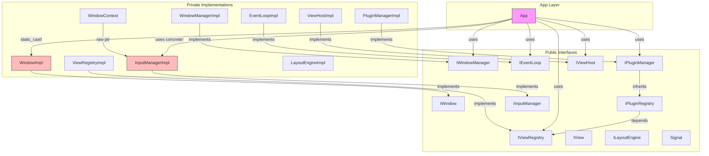

# Отчёт верификации архитектуры SkifRmlUi

**Дата**: 2026-03-01  
**Версия проекта**: 0.1.0  
**Анализируемые документы**: `plans/architecture.md`, `plans/roadmap.md`

---

## 1. Общая оценка архитектурного здоровья

| Критерий | Оценка | Комментарий |
|----------|--------|-------------|
| Соответствие документации | ⚠️ Хорошо с замечаниями | Есть расхождения в именовании API и отсутствующие компоненты |
| Разделение на модули | ✅ Хорошо | Чёткое разделение public/private, интерфейсы отделены от реализации |
| SOLID принципы | ⚠️ Частичное соблюдение | Нарушения ISP и DIP в нескольких местах |
| Управление зависимостями | ⚠️ Есть проблемы | Циклических зависимостей нет, но есть утечки абстракций |
| Управление памятью | ⚠️ Есть риски | Dangling pointers, небезопасные raw pointers |
| Потокобезопасность | ❌ Не обеспечена | Signal и основные компоненты не потокобезопасны |
| Инкапсуляция | ⚠️ Частичная | Публичные Signal в InputManagerImpl нарушают инкапсуляцию |
| Масштабируемость | ⚠️ Ограничена | EventLoop с одним callback блокирует расширение |

**Общая оценка: 6.5/10** — Архитектура в целом следует заявленным принципам, но содержит ряд существенных проблем, требующих исправления до перехода к следующим фазам.

---

## 2. Сводная таблица проблем

| # | Проблема | Файл | Пункт плана | Критичность | Раздел |
|---|----------|------|-------------|-------------|--------|
| P01 | Расхождение API: `RegisterStaticPlugin` vs `RegisterPlugin` | [`app.hpp`](projects/lib/skif-rmlui/include/skif/rmlui/app.hpp) | architecture.md:249 | Незначительная | §3.1 |
| P02 | `WindowConfig` не в `config.hpp`, а в `i_window.hpp` | [`i_window.hpp`](projects/lib/skif-rmlui/include/skif/rmlui/core/i_window.hpp:13) | architecture.md:108 | Незначительная | §3.2 |
| P03 | `IPluginManager` наследует `IPluginRegistry` — нарушение ISP | [`i_plugin_manager.hpp`](projects/lib/skif-rmlui/include/skif/rmlui/plugin/i_plugin_manager.hpp:23) | roadmap.md:136 | Существенная | §4.1 |
| P04 | `IEventLoop` — один callback на событие, нет Signal | [`i_event_loop.hpp`](projects/lib/skif-rmlui/include/skif/rmlui/core/i_event_loop.hpp:47) | roadmap.md:54-60 | Существенная | §4.2 |
| P05 | `App::Impl` хранит `InputManagerImpl*` вместо `IInputManager*` | [`app.cpp`](projects/lib/skif-rmlui/src/app.cpp:43) | roadmap.md:137 | Существенная | §4.3 |
| P06 | `static_cast<WindowImpl&>` в `App::Impl::GetGlfwWindow` | [`app.cpp`](projects/lib/skif-rmlui/src/app.cpp:60) | roadmap.md:138 | Существенная | §4.4 |
| P07 | `Signal::Connection` захватывает `this` — dangling pointer при перемещении | [`signal.hpp`](projects/lib/skif-rmlui/include/skif/rmlui/core/signal.hpp:52) | architecture.md:206-223 | Критическая | §5.1 |
| P08 | `LambdaEventListener` дублируется в sample_panel.cpp | [`sample_panel.cpp`](projects/bin/rmlui-app/plugins/sample_panel.cpp:20) | architecture.md:127 | Незначительная | §3.3 |
| P09 | `App::GetViewHost()` — UB при вызове до `run()` | [`app.cpp`](projects/lib/skif-rmlui/src/app.cpp:101) | architecture.md:79 | Существенная | §5.2 |
| P10 | `InputManagerImpl` — публичные Signal-поля нарушают инкапсуляцию | [`input_manager_impl.hpp`](projects/lib/skif-rmlui/private/implementation/input_manager_impl.hpp:75) | roadmap.md:136 | Существенная | §4.5 |
| P11 | Отсутствие transparent hashing в `unordered_map` | [`view_registry_impl.hpp`](projects/lib/skif-rmlui/private/implementation/view_registry_impl.hpp:40) | roadmap.md:42-49 | Незначительная | §6.1 |
| P12 | `LayoutEngine` не интегрирован с `ViewHost` и `App` | [`app.cpp`](projects/lib/skif-rmlui/src/app.cpp) | roadmap.md:25-29 | Существенная | §3.4 |
| P13 | `mouse_delta_` перезаписывается в callback и сбрасывается в `Update()` | [`input_manager_impl.cpp`](projects/lib/skif-rmlui/src/implementation/input_manager_impl.cpp:56) | architecture.md:134 | Существенная | §5.3 |
| P14 | `Signal` не потокобезопасен | [`signal.hpp`](projects/lib/skif-rmlui/include/skif/rmlui/core/signal.hpp:95) | — | Существенная | §7.1 |
| P15 | `WindowImpl` не проверяет `window_` на nullptr в методах | [`window_impl.cpp`](projects/lib/skif-rmlui/src/implementation/window_impl.cpp:48) | — | Существенная | §5.4 |
| P16 | `App` не реализует Pimpl полностью — приватные методы в заголовке | [`app.hpp`](projects/lib/skif-rmlui/include/skif/rmlui/app.hpp:71) | roadmap.md:140 | Незначительная | §4.6 |
| P17 | `PluginManagerImpl::SetViewRegistry` не в интерфейсе `IPluginManager` | [`plugin_manager_impl.hpp`](projects/lib/skif-rmlui/private/implementation/plugin_manager_impl.hpp:31) | — | Незначительная | §4.7 |
| P18 | `ViewHostImpl::DetachView` ищет по container, но `AttachView` может быть вызван с `nullptr` | [`view_host_impl.cpp`](projects/lib/skif-rmlui/src/implementation/view_host_impl.cpp:86) | — | Существенная | §5.5 |
| P19 | `InjectMouseMove` игнорирует параметры `dx`, `dy` | [`input_manager_impl.cpp`](projects/lib/skif-rmlui/src/implementation/input_manager_impl.cpp:152) | — | Незначительная | §6.2 |
| P20 | `SplitPanel` не завершает замену узла — TODO в коде | [`layout_engine_impl.cpp`](projects/lib/skif-rmlui/src/implementation/layout_engine_impl.cpp:63) | roadmap.md:25 | Существенная | §3.5 |

---

## 3. Соответствие кодовой базы документации

### 3.1 P01: Расхождение именования API — `RegisterStaticPlugin` vs `RegisterPlugin`

**Критичность**: Незначительная

**Документация** ([`architecture.md:249`](plans/architecture.md:249)):
```cpp
app.GetPluginManager().RegisterStaticPlugin(
    std::make_unique<SamplePanelPlugin>()
);
```

**Фактический код** ([`i_plugin_registry.hpp:23`](projects/lib/skif-rmlui/include/skif/rmlui/plugin/i_plugin_registry.hpp:23)):
```cpp
virtual void RegisterPlugin(std::unique_ptr<IPlugin> plugin) = 0;
```

**Анализ**: В документации метод называется `RegisterStaticPlugin`, а в коде — `RegisterPlugin`. Фактический код в [`main.cpp:13`](projects/bin/rmlui-app/main.cpp:13) использует `RegisterPlugin`, что соответствует реализации, но не документации.

**Решение**: Обновить документацию `architecture.md`, заменив `RegisterStaticPlugin` на `RegisterPlugin`.

---

### 3.2 P02: `WindowConfig` определён не в `config.hpp`

**Критичность**: Незначительная

**Документация** ([`architecture.md:108`](plans/architecture.md:108)) указывает `config.hpp` как файл конфигурации и макросов. Однако `WindowConfig` определён в [`i_window.hpp:13`](projects/lib/skif-rmlui/include/skif/rmlui/core/i_window.hpp:13).

**Анализ**: Это логически обосновано — `WindowConfig` тесно связан с `IWindow`. Но `App::GetConfig()` возвращает `WindowConfig&`, что создаёт зависимость `app.hpp` → `i_window.hpp` только ради конфигурации.

**Решение**: Допустимо оставить как есть, но стоит обновить документацию для точности.

---

### 3.3 P08: Дублирование `LambdaEventListener`

**Критичность**: Незначительная

**Документация** ([`architecture.md:127`](plans/architecture.md:127)) указывает `lambda_event_listener.hpp` как часть view-системы.

**Фактический код**: Класс [`LambdaEventListener`](projects/lib/skif-rmlui/include/skif/rmlui/view/lambda_event_listener.hpp:11) определён в публичном заголовке, но в [`sample_panel.cpp:20`](projects/bin/rmlui-app/plugins/sample_panel.cpp:20) создана локальная копия этого же класса вместо использования фреймворкового.

**Решение**: В `sample_panel.cpp` заменить локальный `LambdaEventListener` на:
```cpp
#include <skif/rmlui/view/lambda_event_listener.hpp>
// Использовать skif::rmlui::LambdaEventListener или skif::rmlui::BindEvent()
```

---

### 3.4 P12: `LayoutEngine` не интегрирован

**Критичность**: Существенная

**Документация** ([`roadmap.md:25-29`](plans/roadmap.md:25)):
> - Интеграция LayoutEngine с ViewHost
> - Split панелей через UI

**Фактический код**: В [`app.cpp`](projects/lib/skif-rmlui/src/app.cpp) `LayoutEngine` вообще не создаётся и не используется. `App::Impl` не содержит `std::unique_ptr<ILayoutEngine>`. Файл [`layout_engine_impl.cpp`](projects/lib/skif-rmlui/src/implementation/layout_engine_impl.cpp) компилируется, но класс нигде не инстанцируется.

**Решение**: Добавить `ILayoutEngine` в `App::Impl` и интегрировать с `ViewHost`:
```cpp
struct App::Impl
{
    // ... существующие поля ...
    std::unique_ptr<ILayoutEngine> layout_engine;
};
```

---

### 3.5 P20: `SplitPanel` не завершён

**Критичность**: Существенная

В [`layout_engine_impl.cpp:63`](projects/lib/skif-rmlui/src/implementation/layout_engine_impl.cpp:63):
```cpp
// TODO: implement parent replacement
```

Метод `SplitPanel` создаёт новый сплиттер, но не заменяет исходный узел в дереве, что делает операцию бесполезной. Также `MergePanels` возвращает `false` без реализации.

---

## 4. Анализ SOLID принципов и паттернов

### 4.1 P03: Нарушение Interface Segregation Principle

**Критичность**: Существенная

[`IPluginManager`](projects/lib/skif-rmlui/include/skif/rmlui/plugin/i_plugin_manager.hpp:23) наследует [`IPluginRegistry`](projects/lib/skif-rmlui/include/skif/rmlui/plugin/i_plugin_registry.hpp:17):

```cpp
class IPluginManager : public IPluginRegistry
```

Это означает, что пользователь, получивший `IPluginManager&` через `App::GetPluginManager()`, имеет доступ и к `RegisterPlugin`, и к `LoadPlugin`/`StartPlugins`/`StopPlugins`. Плагины при загрузке получают `IPluginRegistry&`, что корректно. Однако наследование смешивает две роли:
- **Административная** — управление жизненным циклом плагинов
- **Регистрационная** — регистрация плагинов

**Решение**: Разделить интерфейсы. `IPluginManager` должен содержать `IPluginRegistry& GetRegistry()` вместо наследования:
```cpp
class IPluginManager
{
public:
    virtual IPluginRegistry& GetRegistry() = 0;
    virtual bool Initialize() noexcept = 0;
    virtual void Shutdown() noexcept = 0;
    // ...
};
```

---

### 4.2 P04: `IEventLoop` — один callback на событие

**Критичность**: Существенная

**Документация** ([`roadmap.md:54-60`](plans/roadmap.md:54)) явно указывает это как ограничение:
```
// Текущее ограничение: один callback на событие
event_loop->OnUpdate([](float dt) { ... });  // Перезаписывает предыдущий
```

**Фактический код** ([`event_loop_impl.hpp:41`](projects/lib/skif-rmlui/private/implementation/event_loop_impl.hpp:41)):
```cpp
std::optional<UpdateCallback> update_callback_;
```

Использование `std::optional` подтверждает ограничение — только один callback. Это блокирует расширяемость: плагины не могут подписываться на update-цикл.

**Решение**: Заменить `std::optional<Callback>` на `Signal<Args...>`:
```cpp
Signal<float> on_update_;
Signal<>      on_render_;
Signal<>      on_exit_;
```

---

### 4.3 P05: Конкретный тип вместо интерфейса в `App::Impl`

**Критичность**: Существенная

В [`app.cpp:43`](projects/lib/skif-rmlui/src/app.cpp:43):
```cpp
std::unique_ptr<InputManagerImpl> input_manager;  // Конкретный тип!
```

Все остальные менеджеры хранятся через интерфейсы (`std::unique_ptr<IWindowManager>`, `std::unique_ptr<IEventLoop>` и т.д.), но `InputManagerImpl` — исключение. Комментарий объясняет: «для доступа к внутренним методам» (`SetWindow`, `SetContext`, `Update`).

**Анализ**: Это нарушение DIP. Внутренние методы нужны только для инициализации, но хранение конкретного типа делает невозможной подмену реализации.

**Решение**: Создать внутренний интерфейс `IInputManagerInternal`:
```cpp
class IInputManagerInternal : public IInputManager
{
public:
    virtual void SetWindow(GLFWwindow* window) = 0;
    virtual void SetContext(Rml::Context* context) = 0;
    virtual void Update() = 0;
};
```

---

### 4.4 P06: `static_cast` к конкретному типу

**Критичность**: Существенная

В [`app.cpp:60`](projects/lib/skif-rmlui/src/app.cpp:60):
```cpp
static GLFWwindow* GetGlfwWindow(IWindow& window)
{
    return static_cast<WindowImpl&>(window).GetGlfwWindow();
}
```

Это нарушение принципа подстановки Лисков (LSP) и Dependency Inversion. Код предполагает, что `IWindow` всегда является `WindowImpl`.

**Решение**: Использовать `GetNativeHandle()` или добавить метод в приватный интерфейс:
```cpp
// Вариант 1: через GetNativeHandle (уже возвращает GLFWwindow*)
static GLFWwindow* GetGlfwWindow(IWindow& window)
{
    return static_cast<GLFWwindow*>(window.GetNativeHandle());
}
```

---

### 4.5 P10: Публичные Signal-поля в `InputManagerImpl`

**Критичность**: Существенная

В [`input_manager_impl.hpp:75-87`](projects/lib/skif-rmlui/private/implementation/input_manager_impl.hpp:75):
```cpp
Signal<KeyCode> OnKeyDown;
Signal<KeyCode> OnKeyUp;
Signal<MouseButton> OnMouseDown;
Signal<MouseButton> OnMouseUp;
Signal<Vector2f> OnMouseMove;
```

Эти поля `public`, что позволяет любому коду, имеющему доступ к `InputManagerImpl`, вызывать сигналы напрямую (эмулировать ввод). Хотя класс в `private/`, это нарушает инкапсуляцию.

**Решение**: Сделать сигналы приватными и предоставить только метод `Connect`:
```cpp
public:
    Connection OnKeyDown(std::function<void(KeyCode)> callback)
    {
        return key_down_signal_.Connect(std::move(callback));
    }
private:
    Signal<KeyCode> key_down_signal_;
```

---

### 4.6 P16: Неполный Pimpl в `App`

**Критичность**: Незначительная

**Документация** ([`roadmap.md:140`](plans/roadmap.md:140)):
> Pimpl для ABI стабильности — в App и других публичных классах

В [`app.hpp:71-77`](projects/lib/skif-rmlui/include/skif/rmlui/app.hpp:71) приватные методы объявлены в заголовке:
```cpp
private:
    bool InitializeGL(IWindow* window);
    bool InitializeRmlUi(IWindow* window);
    // ...
```

Это нарушает цель Pimpl — скрытие деталей реализации. Изменение сигнатур этих методов потребует перекомпиляции всех зависимых единиц трансляции.

**Решение**: Перенести приватные методы в `App::Impl`:
```cpp
// app.hpp — только публичный API
class App
{
public:
    // ...
private:
    struct Impl;
    std::unique_ptr<Impl> pimpl_;
};

// app.cpp
struct App::Impl
{
    bool InitializeGL(IWindow* window);
    bool InitializeRmlUi(IWindow* window);
    // ...
};
```

---

### 4.7 P17: `SetViewRegistry` не в интерфейсе

**Критичность**: Незначительная

Метод [`PluginManagerImpl::SetViewRegistry`](projects/lib/skif-rmlui/private/implementation/plugin_manager_impl.hpp:31) объявлен в реализации, но также присутствует в [`IPluginManager`](projects/lib/skif-rmlui/include/skif/rmlui/plugin/i_plugin_manager.hpp:27). Однако в `IPluginManager` он `virtual`, а в `PluginManagerImpl` — нет (отсутствует `override`).

**Решение**: Добавить `override` в `PluginManagerImpl::SetViewRegistry`:
```cpp
void SetViewRegistry(IViewRegistry* registry) override;
```

---

## 5. Управление памятью и временем жизни

### 5.1 P07: Dangling pointer в `Signal::Connection` (КРИТИЧЕСКАЯ)

**Критичность**: Критическая

В [`signal.hpp:52`](projects/lib/skif-rmlui/include/skif/rmlui/core/signal.hpp:52):
```cpp
Connection Connect(Callback callback)
{
    const auto id = next_id_++;
    slots_.push_back({id, std::move(callback)});
    
    Connection conn;
    conn.disconnect_fn_ = [this, id]()  // Захват this!
    {
        std::erase_if(slots_, [id](const Slot& s) { return s.id == id; });
    };
    return conn;
}
```

Лямбда в `Connection` захватывает `this` (указатель на `Signal`). Если `Signal` будет уничтожен или перемещён до вызова `Disconnect()`, произойдёт обращение к невалидной памяти (use-after-free).

**Сценарий**: `InputManagerImpl` содержит `Signal<KeyCode> OnKeyDown`. Если `InputManagerImpl` уничтожается, а `Connection` ещё жив — вызов `Disconnect()` приведёт к UB.

**Решение**: Использовать `std::shared_ptr` для shared state:
```cpp
template<typename... Args>
class Signal
{
public:
    Connection Connect(Callback callback)
    {
        auto state = state_;  // shared_ptr копируется
        const auto id = state->next_id++;
        state->slots.push_back({id, std::move(callback)});
        
        Connection conn;
        conn.disconnect_fn_ = [state, id]()  // Захват shared_ptr, не this
        {
            std::erase_if(state->slots, [id](const Slot& s) { return s.id == id; });
        };
        return conn;
    }

private:
    struct State
    {
        std::vector<Slot> slots;
        uint64_t next_id = 0;
    };
    std::shared_ptr<State> state_ = std::make_shared<State>();
};
```

---

### 5.2 P09: UB при вызове `GetViewHost()` до `run()`

**Критичность**: Существенная

В [`app.cpp:101-104`](projects/lib/skif-rmlui/src/app.cpp:101):
```cpp
IViewHost&
App::GetViewHost() noexcept
{
    return *pimpl_->view_host;  // view_host может быть nullptr!
}
```

`view_host` создаётся только в [`InitializeRmlUi`](projects/lib/skif-rmlui/src/app.cpp:209), которая вызывается из `run()`. Если пользователь вызовет `GetViewHost()` до `run()`, произойдёт разыменование nullptr.

**Решение**: Добавить assert или создавать `ViewHost` в конструкторе:
```cpp
IViewHost&
App::GetViewHost() noexcept
{
    assert(pimpl_->view_host && "GetViewHost() called before run()");
    return *pimpl_->view_host;
}
```

---

### 5.3 P13: Гонка данных в `mouse_delta_`

**Критичность**: Существенная

В [`input_manager_impl.cpp:56-63`](projects/lib/skif-rmlui/src/implementation/input_manager_impl.cpp:56):
```cpp
void InputManagerImpl::Update()
{
    key_pressed_.fill(false);
    mouse_wheel_delta_ = mouse_wheel_;
    mouse_wheel_ = 0.0f;
    mouse_delta_ = {0.0f, 0.0f};  // Сброс дельты
}
```

А в [`MouseMoveCallback`](projects/lib/skif-rmlui/src/implementation/input_manager_impl.cpp:256):
```cpp
self->mouse_delta_.x = new_x - self->mouse_position_.x;
self->mouse_delta_.y = new_y - self->mouse_position_.y;
```

Проблема: `Update()` сбрасывает `mouse_delta_` в начале кадра, но GLFW callbacks могут вызываться в любой момент во время `glfwPollEvents()`. Если мышь двигалась несколько раз за кадр, только последнее перемещение будет учтено (предыдущие дельты перезаписываются).

**Решение**: Аккумулировать дельту:
```cpp
// В MouseMoveCallback:
self->accumulated_delta_.x += new_x - self->mouse_position_.x;
self->accumulated_delta_.y += new_y - self->mouse_position_.y;

// В Update():
mouse_delta_ = accumulated_delta_;
accumulated_delta_ = {0.0f, 0.0f};
```

---

### 5.4 P15: Отсутствие проверки `window_` на nullptr

**Критичность**: Существенная

В [`window_impl.cpp`](projects/lib/skif-rmlui/src/implementation/window_impl.cpp) конструктор может не создать окно (строка 23: `if (!window_) return;`), но все методы используют `window_` без проверки:

```cpp
Vector2i WindowImpl::GetSize() const noexcept
{
    int width = 0, height = 0;
    glfwGetWindowSize(window_, &width, &height);  // window_ может быть nullptr!
    return {width, height};
}
```

Если `glfwCreateWindow` вернул `nullptr`, все последующие вызовы GLFW-функций с `nullptr` — UB.

**Решение**: Проверять `window_` или бросать исключение в конструкторе:
```cpp
WindowImpl::WindowImpl(const WindowConfig& config)
{
    // ...
    window_ = glfwCreateWindow(...);
    if (!window_)
    {
        throw std::runtime_error("Failed to create GLFW window");
    }
}
```

---

### 5.5 P18: `DetachView` с nullptr container

**Критичность**: Существенная

В [`view_host_impl.cpp:86`](projects/lib/skif-rmlui/src/implementation/view_host_impl.cpp:86) `DetachView` ищет view по `container`:
```cpp
void ViewHostImpl::DetachView(Rml::Element* container)
{
    for (auto it = attached_views_.begin(); it != attached_views_.end(); ++it)
    {
        if (it->second.container == container)  // container может быть nullptr
```

Но [`AttachView`](projects/lib/skif-rmlui/src/implementation/view_host_impl.cpp:22) может быть вызван с `container = nullptr` (как в [`app.cpp:369`](projects/lib/skif-rmlui/src/app.cpp:369)). Если несколько view присоединены с `nullptr` container, `DetachView(nullptr)` удалит первый найденный.

**Решение**: Добавить перегрузку `DetachView(std::string_view name)` или проверку:
```cpp
virtual void DetachView(std::string_view view_name) = 0;
```

---

## 6. Дополнительные замечания

### 6.1 P11: Отсутствие transparent hashing

**Критичность**: Незначительная

**Документация** ([`roadmap.md:42-49`](plans/roadmap.md:42)) указывает на необходимость transparent hashing.

В [`view_registry_impl.cpp:23`](projects/lib/skif-rmlui/src/implementation/view_registry_impl.cpp:23) и [`plugin_manager_impl.cpp:108`](projects/lib/skif-rmlui/src/implementation/plugin_manager_impl.cpp:108) при каждом поиске создаётся `std::string`:
```cpp
auto it = views_.find(std::string(name));  // Аллокация!
```

**Решение**:
```cpp
struct StringHash
{
    using is_transparent = void;
    size_t operator()(std::string_view sv) const { return std::hash<std::string_view>{}(sv); }
    size_t operator()(const std::string& s) const { return std::hash<std::string>{}(s); }
};

std::unordered_map<std::string, ViewEntry, StringHash, std::equal_to<>> views_;
// Теперь: views_.find(name) — без аллокации
```

---

### 6.2 P19: Неиспользуемые параметры в `InjectMouseMove`

**Критичность**: Незначительная

В [`input_manager_impl.cpp:152-159`](projects/lib/skif-rmlui/src/implementation/input_manager_impl.cpp:152):
```cpp
void InputManagerImpl::InjectMouseMove(int x, int y, int dx, int dy)
{
    if (context_)
    {
        context_->ProcessMouseMove(x, y, 0);  // dx, dy не используются
    }
}
```

Параметры `dx` и `dy` объявлены, но не используются. Это не ошибка, но может вводить в заблуждение.

---

## 7. Потокобезопасность

### 7.1 P14: `Signal` не потокобезопасен

**Критичность**: Существенная

[`Signal`](projects/lib/skif-rmlui/include/skif/rmlui/core/signal.hpp) использует `std::vector<Slot>` без синхронизации. Если `Connect()` вызывается из одного потока, а `operator()` из другого — data race.

**Анализ**: Текущий проект однопоточный (GLFW callbacks вызываются из главного потока). Однако документация упоминает мультиоконность ([`roadmap.md:65-90`](plans/roadmap.md:65)), что может потребовать многопоточности.

**Решение**: Для текущей версии — задокументировать ограничение. Для будущих версий — добавить `std::mutex`:
```cpp
template<typename... Args>
class Signal
{
    mutable std::mutex mutex_;
    // ...
    void operator()(Args... args) const
    {
        std::vector<Slot> slots_copy;
        {
            std::lock_guard lock(mutex_);
            slots_copy = slots_;
        }
        for (const auto& slot : slots_copy)
            slot.callback(args...);
    }
};
```

---

## 8. Диаграмма зависимостей модулей



**Проблемные зависимости** выделены красным:
- `App` → `InputManagerImpl` (конкретный тип вместо интерфейса)
- `App` → `WindowImpl` (через `static_cast`)

---

## 9. Рекомендации по приоритету исправлений

### Критические (исправить немедленно)
1. **P07** — Dangling pointer в `Signal::Connection` — потенциальный use-after-free

### Существенные (исправить до следующей фазы)
2. **P09** — UB при вызове `GetViewHost()` до `run()`
3. **P15** — Отсутствие проверки `window_` на nullptr
4. **P05** — Конкретный тип `InputManagerImpl` в `App::Impl`
5. **P06** — `static_cast` к `WindowImpl`
6. **P13** — Перезапись `mouse_delta_` вместо аккумуляции
7. **P04** — Один callback в `IEventLoop`
8. **P03** — Нарушение ISP в `IPluginManager`
9. **P12** — `LayoutEngine` не интегрирован
10. **P18** — `DetachView` с nullptr container
11. **P20** — Незавершённый `SplitPanel`
12. **P10** — Публичные Signal-поля
13. **P14** — Потокобезопасность Signal (задокументировать)

### Незначительные (исправить при возможности)
14. **P01** — Расхождение именования в документации
15. **P02** — Расположение `WindowConfig`
16. **P08** — Дублирование `LambdaEventListener`
17. **P11** — Transparent hashing
18. **P16** — Неполный Pimpl
19. **P17** — Отсутствие `override`
20. **P19** — Неиспользуемые параметры

---

## 10. Заключение

Архитектура проекта SkifRmlUi в целом следует заявленным принципам: чёткое разделение на публичные интерфейсы и приватные реализации, использование Pimpl, абстрагирование от GLFW через интерфейсы. Однако обнаружена **1 критическая проблема** (dangling pointer в Signal), **12 существенных проблем** (нарушения SOLID, потенциальные UB, незавершённые компоненты) и **7 незначительных замечаний**.

Наиболее важные направления для улучшения:
1. **Безопасность памяти** — исправить Signal, добавить проверки nullptr
2. **Чистота абстракций** — убрать `static_cast` и конкретные типы из App
3. **Расширяемость** — перевести EventLoop на Signal-based callbacks
4. **Завершение Layout System** — интегрировать с App и ViewHost
