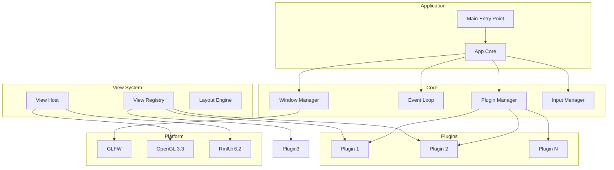

# Архитектура фреймворка SkifRmlUi

## Введение

Фреймворк представляет собой платформу для создания редакторов дизайна (аналог Blender) поверх GLFW/RmlUi/OpenGL. Основные требования:

- Гибридная система плагинов (как Ogre3D/Qt)
- RML документы как "глупые" view (presentation only)
- Логика на C++, обработчики событий навешиваются из C++
- Система панелей как в Blender (split, drag-and-drop "горячие углы")
- Поддержка мультиоконности
- **C++20** с использованием современных возможностей языка
- **Кроссплатформенный код** (Windows, Linux, macOS)
- Поддержка ведущих компиляторов: MSVC, GCC, Clang

## Текущее состояние

**Версия**: 0.1.0  
**Статус**: Фазы 1-5 завершены, фаза 6 в процессе

| Фаза | Название | Статус |
|------|----------|--------|
| 1 | Core Foundation | ✅ Завершено |
| 2 | Plugin System | ✅ Завершено |
| 3 | View System | ✅ Завершено |
| 4 | Layout System | ✅ Завершено (базовая реализация) |
| 5 | Input System | ✅ Завершено |
| 6 | Resource System | 🔄 В процессе |

## C++20 и кроссплатформенность

### Используемые возможности C++20

- **std::unique_ptr** / **std::shared_ptr** — умные указатели
- **std::string_view** — эффективная работа со строками
- **std::function** — type-erased callbacks
- **[[nodiscard]]** — атрибуты для предотвращения ошибок
- **Structured bindings** — `auto [width, height] = window->GetSize()`
- **constexpr** — compile-time вычисления

### Кроссплатформенные решения

- **CMake** — система сборки
- **GLFW** — кроссплатформенное окно и ввод
- **Glad** — загрузка OpenGL
- **RmlUi** — кроссплатформенный UI
- **Preprocessor macros** для платформо-зависимого кода (см. `config.hpp`)

## Высокоуровневая архитектура



## Структура директорий

```
projects/lib/skif-rmlui/
├── include/skif/rmlui/           # Публичные заголовки
│   ├── app.hpp                   # Главный класс приложения
│   ├── config.hpp                # Конфигурация и макросы
│   │
│   ├── core/
│   │   ├── i_window.hpp          # Интерфейс окна
│   │   ├── i_window_manager.hpp
│   │   ├── i_event_loop.hpp
│   │   ├── math_types.hpp        # Vector2i, Vector2f
│   │   └── signal.hpp            # Signal с поддержкой disconnect
│   │
│   ├── plugin/
│   │   ├── i_plugin.hpp
│   │   ├── i_plugin_manager.hpp
│   │   └── i_plugin_registry.hpp
│   │
│   ├── view/
│   │   ├── i_view.hpp
│   │   ├── i_view_host.hpp
│   │   ├── i_view_registry.hpp
│   │   ├── view_descriptor.hpp
│   │   └── lambda_event_listener.hpp
│   │
│   ├── layout/
│   │   ├── i_layout_engine.hpp
│   │   └── layout_node.hpp
│   │
│   └── input/
│       ├── i_input_manager.hpp   # Только query-методы
│       ├── key_codes.hpp
│       └── mouse_buttons.hpp
│
├── private/                      # Приватные заголовки
│   ├── RmlUi/
│   │   └── RendererGlad33.hpp
│   │
│   └── implementation/
│       ├── window_impl.hpp       # Содержит GetGlfwWindow
│       ├── window_manager_impl.hpp
│       ├── event_loop_impl.hpp
│       ├── plugin_manager_impl.hpp
│       ├── view_host_impl.hpp
│       ├── view_registry_impl.hpp
│       ├── layout_engine_impl.hpp
│       ├── input_manager_impl.hpp  # SetWindow, SetContext, Update, Signals
│       └── window_context.hpp      # Единый контекст для GLFW callbacks
│
└── src/
    ├── app.cpp                   # Разбит на методы инициализации
    ├── RmlUi/
    │   └── RendererGlad33.cpp
    │
    └── implementation/
        └── *.cpp
```

## Ключевые интерфейсы

### IWindow

```cpp
class IWindow
{
public:
    virtual ~IWindow() = default;
    
    virtual void* GetNativeHandle() noexcept = 0;
    virtual Vector2i GetSize() const noexcept = 0;
    virtual Vector2i GetFramebufferSize() const noexcept = 0;
    virtual void SetTitle(std::string_view title) noexcept = 0;
    virtual void Close() noexcept = 0;
    virtual bool ShouldClose() const noexcept = 0;
    virtual void MakeContextCurrent() noexcept = 0;
    virtual void SwapBuffers() noexcept = 0;
};
```

### IInputManager (публичный)

```cpp
class IInputManager
{
public:
    virtual ~IInputManager() = default;
    
    // Keyboard
    virtual bool IsKeyDown(KeyCode key) const = 0;
    virtual bool IsKeyPressed(KeyCode key) const = 0;
    
    // Mouse
    virtual Vector2f GetMousePosition() const = 0;
    virtual Vector2f GetMouseDelta() const = 0;
    virtual bool IsMouseButtonDown(MouseButton button) const = 0;
    virtual float GetMouseWheel() const = 0;
};
```

### Signal (с поддержкой disconnect)

```cpp
class Connection
{
public:
    void Disconnect();
    bool IsConnected() const noexcept;
};

template<typename... Args>
class Signal
{
public:
    Connection Connect(std::function<void(Args...)> callback);
    void operator()(Args... args) const;
    void DisconnectAll();
    bool Empty() const noexcept;
    std::size_t Size() const noexcept;
};
```

## Пример использования

### Создание приложения

```cpp
#include <skif/rmlui/app.hpp>

int main(int argc, char* argv[])
{
    skif::rmlui::App app{argc, argv};
    
    // Конфигурация
    app.GetConfig().width = 1280;
    app.GetConfig().height = 720;
    app.GetConfig().title = "My Editor";
    
    // Ресурсы
    app.AddResourceDirectory("assets");
    
    // Начальный view
    app.SetInitialView("sample_panel");
    app.SetFallbackRml("assets/ui/basic.rml");
    
    // Регистрация плагина
    app.GetPluginManager().RegisterStaticPlugin(
        std::make_unique<SamplePanelPlugin>()
    );
    
    return app.run();
}
```

### Создание View

```cpp
#include <skif/rmlui/view/i_view.hpp>
#include <skif/rmlui/view/lambda_event_listener.hpp>

class MyView : public skif::rmlui::IView
{
public:
    void OnCreated(Rml::ElementDocument* document) override
    {
        document_ = document;
        
        // Привязка событий
        skif::rmlui::BindEvent(
            document_->GetElementById("button"),
            "click",
            [this](Rml::Event& event) { OnButtonClicked(event); }
        );
    }
    
    void OnDestroyed() override { document_ = nullptr; }
    void OnShow() override {}
    void OnHide() override {}
    void OnUpdate(float dt) override {}
    
private:
    void OnButtonClicked(Rml::Event& event);
    Rml::ElementDocument* document_ = nullptr;
};
```
