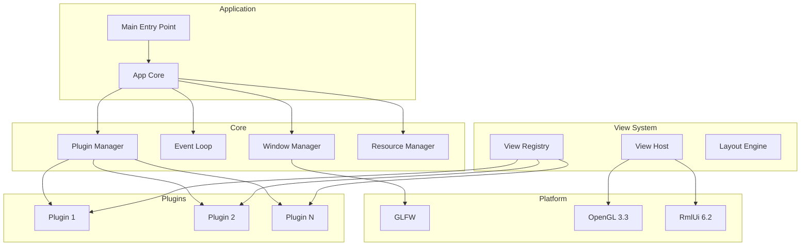

# Архитектура фреймворка SkifRmlUi

## Введение

Фреймворк представляет собой платформу для создания редакторов дизайна (аналог Blender) поверх GLFW/RmlUi/OpenGL. Основные требования:

- Гибридная система плагинов (как Ogre3D/Qt)
- RML документы как "глупые" view (presentation only)
- Логика на C++, обработчики событий навешиваются из C++
- Система панелей как в Blender (split, drag-and-drop "горячие углы")
- Поддержка мультиоконности
- **C++20** с использованием современных возможностей языка
- **Кроссплатформенный код** (Windows, Linux, macOS)
- Поддержка ведущих компиляторов: MSVC, GCC, Clang

## C++20 и кроссплатформенность

### Используемые возможности C++20

- **Concepts** - для ограничения шаблонов
- **Ranges** - для работы с диапазонами
- **std::format** - для форматирования строк
- **std::span** - для безопасной работы с буферами
- **std::unique_ptr** / **std::shared_ptr** - умные указатели
- **std::variant** - типобезопасные объединения
- **std::optional** - для nullable типов
- **constexpr** - compile-time вычисления
- **[[nodiscard]]**, **[[likely]]**, **[[unlikely]]** - атрибуты

### Кроссплатформенные решения

- **CMake** - система сборки
- **GLFW** - кроссплатформенное окно и ввод
- **Glad** - загрузка OpenGL
- **RmlUi** - кроссплатформенный UI
- **Preprocessor macros** для платформо-зависимого кода:
  - `SKIF_PLATFORM_WINDOWS`, `SKIF_PLATFORM_LINUX`, `SKIF_PLATFORM_MACOS`
  - `SKIF_COMPILER_MSVC`, `SKIF_COMPILER_GCC`, `SKIF_COMPILER_CLANG`

### Макросы для экспорта плагинов

```cpp
// Кроссплатформенный экспорт/импорт плагинов
#if defined(SKIF_PLATFORM_WINDOWS)
    #if defined(SKIF_PLUGIN_EXPORTS)
        #define SKIF_PLUGIN_API __declspec(dllexport)
    #else
        #define SKIF_PLUGIN_API __declspec(dllimport)
    #endif
#else
    #if defined(SKIF_PLUGIN_EXPORTS)
        #define SKIF_PLUGIN_API __attribute__((visibility("default")))
    #else
        #define SKIF_PLUGIN_API
    #endif
#endif

// Экспорт функции плагина
#define SKIF_PLUGIN_EXPORT extern "C" SKIF_PLUGIN_API
```

## Высокоуровневая архитектура



## Компоненты фреймворка

### 1. Core (Ядро)

#### 1.1 Window Manager
- Абстракция над GLFW окнами
- Поддержка нескольких окон
- Управление контекстами OpenGL
- События изменения размера, фокуса, закрытия

```cpp
namespace skif::rmlui
{
class IWindow
{
public:
    virtual ~IWindow() = default;
    
    virtual void* GetNativeHandle() = 0;
    virtual Vector2i GetSize() const = 0;
    virtual Vector2i GetFramebufferSize() const = 0;
    virtual void SetTitle(std::string_view title) = 0;
    virtual void Close() = 0;
    virtual bool ShouldClose() const = 0;
    virtual void SwapBuffers() = 0;
    
    // Events
    Signal<void(Vector2i size)> OnResize;
    Signal<void()> OnClose;
    Signal<void()> OnFocus;
    Signal<void()> OnFocusLost;
};

class IWindowManager
{
public:
    virtual ~IWindowManager() = default;
    
    virtual std::shared_ptr<IWindow> CreateWindow(WindowConfig config) = 0;
    virtual void DestroyWindow(std::shared_ptr<IWindow> window) = 0;
    virtual void PollEvents() = 0;
    virtual void WaitEvents() = 0;
};
}
```

#### 1.2 Event Loop
- Главный цикл приложения
- Управление временем (delta time, fixed update)
- Обработка ввода

```cpp
class IEventLoop
{
public:
    virtual ~IEventLoop() = default;
    
    virtual void Run() = 0;
    virtual void Stop() = 0;
    virtual bool IsRunning() const = 0;
    
    virtual void SetFixedDeltaTime(float dt) = 0;
    virtual float GetDeltaTime() const = 0;
    virtual float GetTotalTime() const = 0;
    
    Signal<void(float dt)> OnUpdate;
    Signal<void()> OnRender;
};
```

#### 1.3 Plugin Manager
- Гибридная загрузка плагинов (статическая + динамическая)
- Регистрация плагинов
- Управление жизненным циклом плагинов

```cpp
class IPlugin
{
public:
    virtual ~IPlugin() = default;
    
    virtual std::string_view GetName() const = 0;
    virtual Version GetVersion() const = 0;
    
    virtual void OnLoad(IPluginRegistry& registry) = 0;
    virtual void OnUnload() = 0;
};

class IPluginManager
{
public:
    virtual ~IPluginManager() = default;
    
    // Static plugins (linked at compile time)
    virtual void RegisterStaticPlugin(std::unique_ptr<IPlugin> plugin) = 0;
    
    // Dynamic plugins (loaded at runtime)
    virtual bool LoadPlugin(std::string_view path) = 0;
    virtual void UnloadPlugin(std::string_view name) = 0;
    
    virtual IPlugin* GetPlugin(std::string_view name) const = 0;
    virtual Span<IPlugin* const> GetPlugins() const = 0;
};

// Plugin export macros (similar to Q_PLUGIN_METADATA or OGRE_EXTERN)
// Кроссплатформенный экспорт/импорт плагинов
#if defined(SKIF_PLATFORM_WINDOWS)
    #if defined(SKIF_PLUGIN_EXPORTS)
        #define SKIF_PLUGIN_API __declspec(dllexport)
    #else
        #define SKIF_PLUGIN_API __declspec(dllimport)
    #endif
#else
    #if defined(SKIF_PLUGIN_EXPORTS)
        #define SKIF_PLUGIN_API __attribute__((visibility("default")))
    #else
        #define SKIF_PLUGIN_API
    #endif
#endif

// Экспорт функции плагина
#define SKIF_PLUGIN_EXPORT extern "C" SKIF_PLUGIN_API
```

### 2. View System (Система представлений)

#### 2.1 View Registry
- Реестр доступных view
- Регистрация view плагинами
- Фабрика view

```cpp
struct ViewDescriptor
{
    std::string name;           // Уникальное имя view
    std::string rml_path;       // Путь к RML файлу
    std::string category;       // Категория (для UI)
    std::string display_name;   // Отображаемое имя
};

class IView
{
public:
    virtual ~IView() = default;
    
    virtual void OnCreated(Rml::ElementDocument* document) = 0;
    virtual void OnDestroyed() = 0;
    virtual void OnShow() = 0;
    virtual void OnHide() = 0;
    virtual void OnUpdate(float dt) = 0;
    
    virtual void BindEvent(Rml::Element* element, 
                          std::string_view event_name,
                          std::function<void(Rml::Event&)> handler) = 0;
};

class IViewRegistry
{
public:
    virtual ~IViewRegistry() = default;
    
    virtual void RegisterView(ViewDescriptor descriptor, 
                             std::function<std::unique_ptr<IView>()> factory) = 0;
    
    virtual std::unique_ptr<IView> CreateView(std::string_view name) const = 0;
    virtual const ViewDescriptor* GetDescriptor(std::string_view name) const = 0;
    virtual Span<const ViewDescriptor> GetAllDescriptors() const = 0;
};
```

#### 2.2 View Host
- Хост для отображения view в RmlUi контексте
- Управление несколькими view
- Интеграция с Layout Engine

```cpp
class IViewHost
{
public:
    virtual ~IViewHost() = 0;
    
    virtual void AttachView(std::string_view view_name, 
                           Rml::Element* container) = 0;
    virtual void DetachView(Rml::Element* container) = 0;
    virtual IView* GetActiveView() const = 0;
    
    virtual void ShowView(std::string_view name) = 0;
    virtual void HideView(std::string_view name) = 0;
};
```

### 3. Layout System (Система раскладки)

Аналог системы панелей Blender:
- Split панелей в любую сторону
- Drag-and-drop "горячие углы" для разделения
- Вложенные панели
- Минимальный размер панелей

```cpp
enum class SplitDirection
{
    Horizontal,
    Vertical
};

struct LayoutNode
{
    std::string view_name;      // Имя view или пусто для сплиттера
    float ratio;                // Соотношение размеров (0.0 - 1.0)
    float min_size;             // Минимальный размер
    
    std::unique_ptr<LayoutNode> first;   // Первая панель
    std::unique_ptr<LayoutNode> second;  // Вторая панель
    SplitDirection direction;            // Направление сплита
    
    bool is_splitter;           // Это сплиттер (не панель)
};

class ILayoutEngine
{
public:
    virtual ~ILayoutEngine() = default;
    
    // Создать корневую панель
    virtual void SetRoot(std::unique_ptr<LayoutNode> root) = 0;
    
    // Split панели
    virtual void SplitPanel(Rml::Element* panel, 
                           SplitDirection direction,
                           float ratio = 0.5f) = 0;
    
    // Merge панелей
    virtual void MergePanels(Rml::Element* first, Rml::Element* second) = 0;
    
    // Drag handling для сплиттеров
    virtual void BeginDrag(Rml::Element* splitter) = 0;
    virtual void UpdateDrag(Vector2f mouse_pos) = 0;
    virtual void EndDrag() = 0;
    
    // Генерация RML для панелей
    virtual std::string GenerateRML() const = 0;
};
```

### 4. Resource System (Система ресурсов)

```cpp
class IResourceManager
{
public:
    virtual ~IResourceManager() = default;
    
    // Добавить директорию ресурсов
    virtual void AddResourceDirectory(std::string_view path) = 0;
    
    // Загрузка RML
    virtual std::optional<std::string> LoadRML(std::string_view path) = 0;
    
    // Загрузка шрифтов
    virtual bool LoadFont(std::string_view path) = 0;
    
    // Поиск ресурса
    virtual std::optional<std::filesystem::path> FindResource(
        std::string_view name) const = 0;
};
```

### 5. Input System (Система ввода)

```cpp
enum class KeyCode
{
    // ... GLFW key codes
};

enum class MouseButton
{
    Left,
    Right,
    Middle,
    // ...
};

class IInputManager
{
public:
    virtual ~IInputManager() = default;
    
    // Keyboard
    virtual bool IsKeyDown(KeyCode key) const = 0;
    virtual bool IsKeyPressed(KeyCode key) const = 0;  // Single frame
    
    // Mouse
    virtual Vector2f GetMousePosition() const = 0;
    virtual Vector2f GetMouseDelta() const = 0;
    virtual bool IsMouseButtonDown(MouseButton button) const = 0;
    virtual float GetMouseWheel() const = 0;
    
    // RmlUi input integration
    virtual void InjectKeyDown(Rml::Input::KeyIdentifier key, 
                              int modifiers) = 0;
    virtual void InjectKeyUp(Rml::Input::KeyIdentifier key,
                            int modifiers) = 0;
    virtual void InjectMouseMove(int x, int y,
                                int dx, int dy) = 0;
    virtual void InjectMouseDown(int x, int y,
                                Rml::Input::MouseButton button,
                                int modifiers) = 0;
    virtual void InjectMouseUp(int x, int y,
                              Rml::Input::MouseButton button,
                              int modifiers) = 0;
    
    // Global input events
    Signal<void(KeyCode)> OnKeyDown;
    Signal<void(KeyCode)> OnKeyUp;
    Signal<void(MouseButton)> OnMouseDown;
    Signal<void(MouseButton)> OnMouseUp;
    Signal<void(Vector2f)> OnMouseMove;
};
```

## Структура директорий

```
projects/lib/skif-rmlui/
├── include/skif/rmlui/
│   ├── app.hpp                 # Главный класс приложения
│   ├── config.hpp              # Конфигурация
│   ├── version.hpp             # Версия фреймворка
│   │
│   ├── core/
│   │   ├── i_window.hpp        # Интерфейс окна
│   │   ├── i_window_manager.hpp
│   │   ├── i_event_loop.hpp
│   │   ├── i_plugin.hpp        # Интерфейс плагина
│   │   ├── i_plugin_manager.hpp
│   │   └── i_plugin_registry.hpp
│   │
│   ├── view/
│   │   ├── i_view.hpp          # Интерфейс view
│   │   ├── i_view_host.hpp
│   │   ├── i_view_registry.hpp
│   │   └── view_descriptor.hpp
│   │
│   ├── layout/
│   │   ├── i_layout_engine.hpp
│   │   └── layout_node.hpp
│   │
│   ├── resource/
│   │   ├── i_resource_manager.hpp
│   │   └── resource_locator.hpp
│   │
│   └── input/
│       ├── i_input_manager.hpp
│       ├── key_codes.hpp
│       └── mouse_buttons.hpp
│
├── private/
│   ├── rmlui/
│   │   └── renderer_glad33.hpp
│   │
│   └── implementation/
│       ├── window_manager_impl.hpp
│       ├── event_loop_impl.hpp
│       ├── plugin_manager_impl.hpp
│       ├── view_host_impl.hpp
│       ├── layout_engine_impl.hpp
│       ├── resource_manager_impl.hpp
│       └── input_manager_impl.hpp
│
└── src/
    ├── app.cpp
    ├── rmlui/
    │   └── renderer_glad33.cpp
    │
    └── implementation/
        ├── window_manager_impl.cpp
        ├── event_loop_impl.cpp
        ├── plugin_manager_impl.cpp
        ├── view_host_impl.cpp
        ├── layout_engine_impl.cpp
        ├── resource_manager_impl.cpp
        └── input_manager_impl.cpp
```

## Пример использования (C++20)

### Создание плагина

```cpp
// my_plugin.hpp
#include <skif/rmlui/plugin.hpp>
#include <memory>

class MyPlugin : public skif::rmlui::IPlugin
{
public:
    [[nodiscard]] std::string_view GetName() const noexcept override
    {
        return "MyPlugin";
    }
    
    [[nodiscard]] Version GetVersion() const noexcept override
    {
        return Version{1, 0, 0};
    }
    
    void OnLoad(skif::rmlui::IPluginRegistry& registry) override
    {
        registry.RegisterView(
            skif::rmlui::ViewDescriptor{
                .name = "my_view",
                .rml_path = "plugins/my_plugin/view.rml",
                .category = "Custom",
                .display_name = "My View"
            },
            []() -> std::unique_ptr<skif::rmlui::IView>
            {
                return std::make_unique<MyView>();
            }
        );
    }
    
    void OnUnload() noexcept override {}
};

// Регистрация плагина (статическая линковка)
SKIF_REGISTER_STATIC_PLUGIN(MyPlugin)

// Или экспорт для динамической загрузки
// SKIF_PLUGIN_EXPORT IPlugin* GetPlugin() { return new MyPlugin(); }
```

### Реализация View

```cpp
// my_view.hpp
#include <skif/rmlui/view/i_view.hpp>
#include <memory>
#include <functional>

class MyView : public skif::rmlui::IView
{
public:
    void OnCreated(Rml::ElementDocument* document) override
    {
        document_ = document;
        
        // Bind events from RML using C++20 lambda
        BindEvent(document_->GetElementById("button"), "click",
            [this](Rml::Event& event) noexcept {
                OnButtonClicked(event);
            });
        
        BindEvent(document_->GetElementById("input"), "change",
            [this](Rml::Event& event) noexcept {
                OnInputChanged(event);
            });
    }
    
    void OnDestroyed() noexcept override { document_ = nullptr; }
    void OnShow() noexcept override {}
    void OnHide() noexcept override {}
    
    void OnUpdate(float dt) noexcept override
    {
        // Update logic
    }
    
private:
    void OnButtonClicked(Rml::Event& event) noexcept;
    void OnInputChanged(Rml::Event& event) noexcept;
    
    Rml::ElementDocument* document_ = nullptr;
};
```

### Создание приложения

```cpp
// main.cpp
#include <skif/rmlui/app.hpp>
#include <cstdlib>

auto main(int argc, char* argv[]) -> int
{
    using namespace skif::rmlui;
    
    App app {argc, argv};
    
    // Конфигурация
    app.GetConfig().SetDefaultWindowSize(1280, 720);
    app.GetConfig().SetTitle("My Editor");
    
    // Добавление ресурсов
    app.GetResourceManager().AddResourceDirectory("assets");
    app.GetResourceManager().AddResourceDirectory("plugins");
    
    return app.run();
}
```

## Следующие шаги реализации

1. **Фаза 1: Core Foundation**
   - Рефакторинг App класса
   - Выделение IWindowManager, IEventLoop
   - Реализация базового Window Manager

2. **Фаза 2: Plugin System**
   - Интерфейсы IPlugin, IPluginManager
   - Система регистрации статических плагинов
   - Базовая поддержка динамической загрузки

3. **Фаза 3: View System**
   - Интерфейсы IView, IViewRegistry
   - View Host для отображения в RmlUi
   - Пример простого view

4. **Фаза 4: Layout System**
   - Модель данных для панелей
   - Генерация RML для layout
   - Обработка drag-and-drop для сплиттеров

5. **Фаза 5: Input System**
   - Интеграция с GLFW событиями
   - Прокидывание ввода в RmlUi

6. **Фаза 6: Resource System**
   - Управление директориями ресурсов
   - Загрузка RML и шрифтов