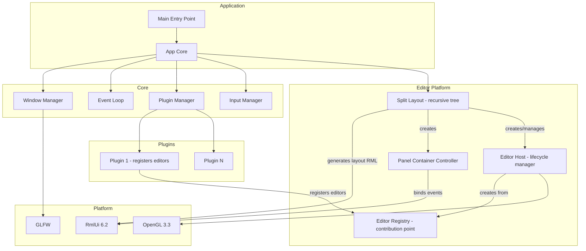
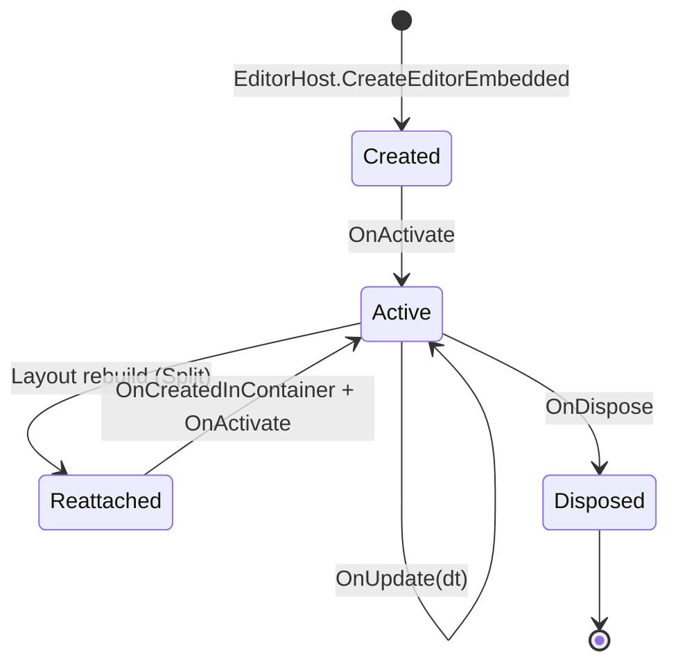

# Архитектура фреймворка SkifRmlUi

## Введение

Фреймворк представляет собой платформу для создания редакторов (аналог Blender) поверх GLFW/RmlUi/OpenGL. Основные требования:

- Система панелей как в Blender — рекурсивный split layout с drag-and-drop разделителями
- Каждая панель — обособленный **Editor** со своим view, menu и содержимым
- RML документы как presentation layer, логика на C++
- Регистрация редакторов из плагинов через **contribution points**
- **C++20**, CMake 3.30, MinGW/GCC
- Кроссплатформенный код (MSVC, GCC, Clang)

## Текущее состояние

**Версия**: 0.2.5

| Компонент | Статус |
|-----------|--------|
| Core (Window, EventLoop) | ✅ Завершено |
| Plugin System | ✅ Завершено |
| Input System | ✅ Завершено |
| Editor Platform (Registry, Host, SplitLayout) | ✅ Завершено |
| Panel Container (Header, Content, StatusBar, HotCorners) | ✅ Завершено |
| Divider Drag | ✅ Завершено |
| Hot Corner Split (Horizontal + Alt→Vertical) | ✅ Завершено |

## Ключевые концепции

### Editor — обособленный редактор в панели

**Editor** — самодостаточная единица UI, аналог Area/Editor в Blender. Каждый Editor:
- Имеет собственный RML контент (view), загружаемый в panel-content div
- Имеет собственное меню (header bar) из `EditorDescriptor::menu_entries`
- Управляет жизненным циклом: `OnCreated` → `OnActivate` → `OnUpdate` → `OnDeactivate` → `OnDispose`
- Регистрируется из плагина через `IEditorRegistry` (contribution point)
- Поддерживает embedded режим через `OnCreatedInContainer(document, content_container)` для scoped поиска элементов

### SplitLayout — рекурсивное дерево панелей

Layout — бинарное дерево `SplitNode`:
- **Leaf** — панель с конкретным Editor, обёрнутая в Panel Container
- **Split** — разделитель с двумя дочерними узлами и направлением (horizontal/vertical)

Layout генерирует единый RML документ через `LoadDocumentFromMemory`, содержащий всю структуру split-панелей с dividers, panel containers, header bars.

### Panel Container — обёртка каждой панели

Каждый leaf-узел генерирует Panel Container:
- **Header bar** — dropdown выбора типа редактора + menu items
- **Hot corners** — drag-зоны для split (верхние) и merge (нижние)
- **Content area** — RML контент Editor'а (вставляется через `SetInnerRML`)
- **Status bar** — текст из `IEditor::GetStatusText()`

### Contribution Points — точки расширения

Плагины регистрируют компоненты через contribution points:
- `IEditorRegistry` — регистрация типов редакторов с `EditorDescriptor` и `EditorFactory`

## Высокоуровневая архитектура



## Жизненный цикл Editor



При Split/Merge layout документ пересоздаётся, но editor instances сохраняются через `ReattachEditorEmbedded` — состояние (данные модели) не теряется.

## Рекурсивное обновление SplitLayout

```
App::Update(dt)
  → SplitLayout::Update(dt)
    → рекурсивный обход дерева SplitNode
      → для каждого leaf: EditorHost::UpdateEditor(instance_id, dt)
        → editor->OnUpdate(dt)
    → для каждого PanelContainerController: UpdateStatusBar()
```

## Структура директорий

```
projects/lib/skif-rmlui/
├── include/skif/rmlui/           # Публичные заголовки
│   ├── app.hpp                   # Главный класс приложения
│   ├── config.hpp                # Конфигурация и макросы
│   ├── core/
│   │   ├── i_window.hpp
│   │   ├── i_window_manager.hpp
│   │   ├── i_event_loop.hpp
│   │   ├── math_types.hpp
│   │   └── signal.hpp
│   ├── plugin/
│   │   ├── i_plugin.hpp
│   │   ├── i_plugin_manager.hpp
│   │   └── i_plugin_registry.hpp
│   ├── editor/
│   │   ├── i_editor.hpp          # IEditor + OnCreatedInContainer
│   │   ├── editor_descriptor.hpp # EditorDescriptor + rcss_path
│   │   ├── i_editor_registry.hpp # Contribution point
│   │   ├── i_editor_host.hpp     # Lifecycle manager
│   │   ├── i_split_layout.hpp    # Рекурсивный layout
│   │   └── split_node.hpp        # SplitNode: Leaf | Split
│   ├── input/
│   │   ├── i_input_manager.hpp
│   │   ├── key_codes.hpp
│   │   └── mouse_buttons.hpp
│   └── view/
│       └── lambda_event_listener.hpp  # Утилита BindEvent()
│
├── private/implementation/
│   ├── editor_registry_impl.hpp
│   ├── editor_host_impl.hpp      # CreateEditorEmbedded, ReattachEditorEmbedded, RenameInstance
│   ├── split_layout_impl.hpp     # Layout document, PanelControllers, Divider drag
│   ├── panel_container_controller.hpp  # Event bindings для panel container
│   ├── window_impl.hpp
│   ├── window_manager_impl.hpp
│   ├── event_loop_impl.hpp
│   ├── plugin_manager_impl.hpp
│   ├── input_manager_impl.hpp
│   └── window_context.hpp
│
└── src/implementation/
    └── *.cpp
```

## Ключевые интерфейсы

### IEditor

```cpp
class IEditor
{
public:
    virtual const EditorDescriptor& GetDescriptor() const noexcept = 0;
    virtual void OnCreated(Rml::ElementDocument* document) = 0;
    virtual void OnCreatedInContainer(Rml::ElementDocument* document, Rml::Element* content_container)
    {
        OnCreated(document);  // Default: fallback к legacy
    }
    virtual void OnActivate() = 0;
    virtual void OnDeactivate() = 0;
    virtual void OnUpdate(float delta_time) = 0;
    virtual void OnDispose() noexcept = 0;
    virtual std::string_view GetStatusText() const noexcept { return {}; }
};
```

### EditorDescriptor

```cpp
struct EditorDescriptor
{
    std::string name;           // "sample_panel"
    std::string display_name;   // "Sample Panel"
    std::string rml_path;       // "assets/ui/sample_panel.rml"
    std::string rcss_path;      // "assets/ui/sample_panel.rcss"
    std::string icon;
    std::string category;       // "Panels"
    std::vector<MenuEntry> menu_entries;
};
```

### ISplitLayout

```cpp
class ISplitLayout
{
public:
    virtual void SetRoot(std::unique_ptr<SplitNode> root) = 0;
    virtual const SplitNode* GetRoot() const noexcept = 0;
    virtual bool Split(const SplitNode* panel, SplitDirection direction,
                       std::string_view new_editor_name, float ratio = 0.5f) = 0;
    virtual bool Merge(const SplitNode* split_node, bool keep_first = true) = 0;
    virtual bool SwitchEditor(const SplitNode* panel, std::string_view new_editor_name) = 0;
    virtual void Update(float delta_time) = 0;
    virtual void Initialize() = 0;
    virtual void ApplyLayout() = 0;
    virtual std::string GenerateRML() const = 0;
};
```

## Пример использования

### main.cpp

```cpp
#include <skif/rmlui/app.hpp>
#include <skif/rmlui/editor/split_node.hpp>
#include "plugins/sample_panel.hpp"

int main(int argc, char* argv[])
{
    skif::rmlui::App app{argc, argv};
    
    app.GetPluginManager().RegisterPlugin(
        std::make_unique<sample::SamplePanelPlugin>()
    );
    
    app.SetInitialLayout(SplitNode::MakeLeaf("sample_panel"));
    app.SetFallbackRml("assets/ui/basic.rml");
    
    return app.run();
}
```

### Editor в плагине

```cpp
class SampleEditor : public skif::rmlui::IEditor
{
public:
    void OnCreatedInContainer(Rml::ElementDocument* document, Rml::Element* container) override
    {
        document_ = document;
        container_ = container;
        // Scoped поиск — работает корректно при нескольких экземплярах
        auto* btn = container->QuerySelector("#increment-button");
        if (btn)
            BindEvent(btn, "click", [this](Rml::Event&) { counter_++; UpdateDisplay(); });
    }
    
    void OnUpdate(float dt) override { /* каждый кадр */ }
    
private:
    Rml::ElementDocument* document_ = nullptr;
    Rml::Element* container_ = nullptr;
    int counter_ = 0;
};

// Регистрация в плагине:
void SamplePanelPlugin::OnLoad(IPluginRegistry& registry)
{
    EditorDescriptor desc;
    desc.name = "sample_panel";
    desc.display_name = "Sample Panel";
    desc.rml_path = "assets/ui/sample_panel.rml";
    desc.rcss_path = "assets/ui/sample_panel.rcss";
    
    registry.GetEditorRegistry().RegisterEditor(
        std::move(desc),
        []() { return std::make_unique<SampleEditor>(); }
    );
}
```

## Архитектурные принципы

1. **Публичные интерфейсы минимальны** — только то, что нужно пользователям
2. **Детали реализации скрыты** — в `private/` и `Impl` классах
3. **GLFW-зависимости изолированы** — не в публичных заголовках
4. **Pimpl для ABI стабильности** — в App и других публичных классах
5. **Contribution points** — плагины расширяют систему через регистрацию
6. **Рекурсивный layout** — обновление сверху вниз, каждый Editor независим
7. **Editor = самодостаточная единица** — view + menu + логика, управляется EditorHost
8. **Единый layout документ** — все панели в одном RML, Editor контент вставляется через SetInnerRML
9. **Сохранение состояния при Split** — editor instances не уничтожаются, перепривязываются к новому DOM
