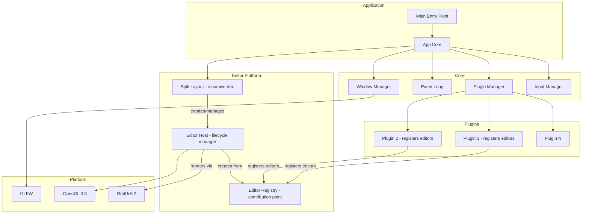
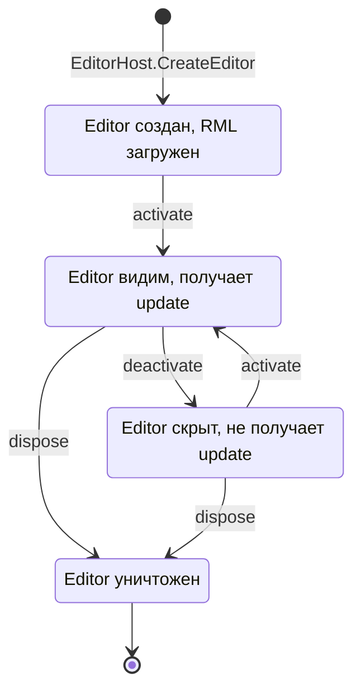
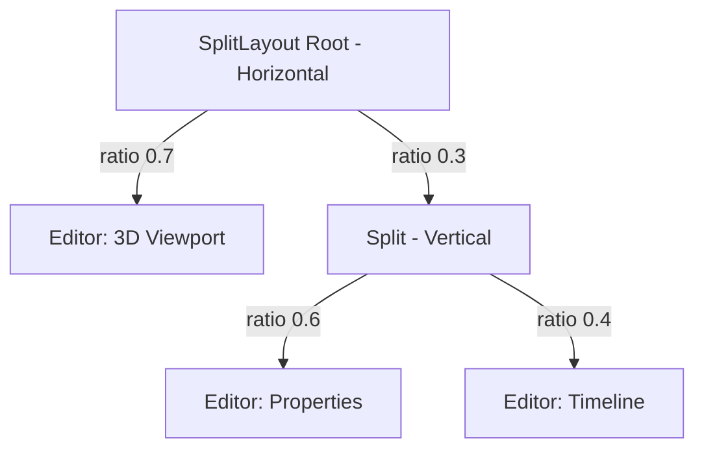

# Архитектура фреймворка SkifRmlUi

## Введение

Фреймворк представляет собой платформу для создания редакторов дизайна (аналог Blender) поверх GLFW/RmlUi/OpenGL. Основные требования:

- Система панелей как в Blender — рекурсивный split layout с drag-and-drop разделителями
- Каждая панель — обособленный **Editor** со своим view, menu и содержимым
- RML документы как presentation layer, логика на C++
- Регистрация редакторов из плагинов через **contribution points**
- Гибридная система плагинов (статическая + динамическая загрузка)
- Поддержка мультиоконности
- **C++20** с использованием современных возможностей языка
- **Кроссплатформенный код** (Windows, Linux, macOS)
- Поддержка ведущих компиляторов: MSVC, GCC, Clang

## Текущее состояние

**Версия**: 0.2.0  
**Статус**: Рефакторинг архитектуры — переход к редакторной платформе

| Фаза | Название | Статус |
|------|----------|--------|
| 1 | Core Foundation | ✅ Завершено |
| 2 | Plugin System | ✅ Завершено |
| 3 | View System | 🔄 Рефакторинг → Editor System |
| 4 | Layout System | 🔄 Рефакторинг → SplitLayout |
| 5 | Input System | ✅ Завершено |
| 6 | Editor Platform | 🆕 В разработке |

## Ключевые концепции

### Editor — обособленный редактор в панели

**Editor** — это самодостаточная единица UI, аналог Area/Editor в Blender. Каждый Editor:
- Имеет собственный RML документ (view)
- Может иметь собственное меню (header bar)
- Управляет своим жизненным циклом: `activate` / `deactivate` / `update` / `dispose`
- Регистрируется из плагина через `IEditorRegistry`

### SplitLayout — рекурсивное дерево панелей

Layout представляет собой бинарное дерево, где:
- **Leaf** — панель с конкретным Editor
- **Split** — разделитель с двумя дочерними узлами и направлением (horizontal/vertical)
- Обновление идёт рекурсивно от корня вниз — каждый Editor обновляется независимо

### Contribution Points — точки расширения

Плагины регистрируют свои компоненты через contribution points:
- `IEditorRegistry` — регистрация типов редакторов
- В будущем: `IMenuContribution`, `ICommandRegistry`, `IThemeContribution`

## C++20 и кроссплатформенность

### Используемые возможности C++20

- **std::unique_ptr** / **std::shared_ptr** — умные указатели
- **std::string_view** — эффективная работа со строками
- **std::function** — type-erased callbacks
- **[[nodiscard]]** — атрибуты для предотвращения ошибок
- **Structured bindings** — `auto [width, height] = window->GetSize()`
- **constexpr** — compile-time вычисления
- **Concepts** — `Rml::meta::OpenGL33Context` для шаблонного рендерера

### Кроссплатформенные решения

- **CMake** — система сборки
- **GLFW** — кроссплатформенное окно и ввод
- **Glad** — загрузка OpenGL
- **RmlUi** — кроссплатформенный UI
- **Preprocessor macros** для платформо-зависимого кода (см. `config.hpp`)

## Высокоуровневая архитектура



## Архитектура Editor Platform

### Жизненный цикл Editor



### Рекурсивное обновление SplitLayout



При обновлении: `App::Update()` → `SplitLayout::Update(dt)` → рекурсивно обходит дерево → для каждого leaf вызывает `EditorHost::UpdateEditor(editor, dt)` → `editor->OnUpdate(dt)`

## Структура директорий

```
projects/lib/skif-rmlui/
├── include/skif/rmlui/           # Публичные заголовки
│   ├── app.hpp                   # Главный класс приложения
│   ├── config.hpp                # Конфигурация и макросы
│   │
│   ├── core/
│   │   ├── i_window.hpp          # Интерфейс окна
│   │   ├── i_window_manager.hpp
│   │   ├── i_event_loop.hpp
│   │   ├── math_types.hpp        # Vector2i, Vector2f, Rect
│   │   └── signal.hpp            # Signal с поддержкой disconnect
│   │
│   ├── plugin/
│   │   ├── i_plugin.hpp
│   │   ├── i_plugin_manager.hpp
│   │   └── i_plugin_registry.hpp
│   │
│   ├── editor/                   # 🆕 Editor Platform
│   │   ├── i_editor.hpp          # Интерфейс редактора
│   │   ├── editor_descriptor.hpp # Метаданные редактора
│   │   ├── i_editor_registry.hpp # Contribution point для регистрации
│   │   ├── i_editor_host.hpp     # Управление жизненным циклом
│   │   └── i_split_layout.hpp    # Рекурсивный layout
│   │
│   ├── layout/
│   │   ├── i_layout_engine.hpp   # (deprecated → i_split_layout.hpp)
│   │   └── layout_node.hpp       # (deprecated → split_node внутри split_layout)
│   │
│   ├── view/                     # (deprecated → editor/)
│   │   ├── i_view.hpp
│   │   ├── i_view_host.hpp
│   │   ├── i_view_registry.hpp
│   │   ├── view_descriptor.hpp
│   │   └── lambda_event_listener.hpp  # Остаётся как утилита
│   │
│   └── input/
│       ├── i_input_manager.hpp   # Только query-методы
│       ├── key_codes.hpp
│       └── mouse_buttons.hpp
│
├── private/                      # Приватные заголовки
│   ├── RmlUi/
│   │   └── RendererGlad33.hpp
│   │
│   └── implementation/
│       ├── window_impl.hpp
│       ├── window_manager_impl.hpp
│       ├── event_loop_impl.hpp
│       ├── plugin_manager_impl.hpp
│       ├── editor_registry_impl.hpp  # 🆕
│       ├── editor_host_impl.hpp      # 🆕
│       ├── split_layout_impl.hpp     # 🆕
│       ├── input_manager_impl.hpp
│       └── window_context.hpp
│
└── src/
    ├── app.cpp
    ├── RmlUi/
    │   └── RendererGlad33.cpp
    │
    └── implementation/
        └── *.cpp
```

## Ключевые интерфейсы

### IEditor

```cpp
class IEditor
{
public:
    virtual ~IEditor() = default;
    
    /// Получить дескриптор редактора
    [[nodiscard]] virtual const EditorDescriptor& GetDescriptor() const noexcept = 0;
    
    /// Вызывается при создании — RML документ загружен
    virtual void OnCreated(Rml::ElementDocument* document) = 0;
    
    /// Вызывается при активации — редактор стал видимым в панели
    virtual void OnActivate() = 0;
    
    /// Вызывается при деактивации — редактор скрыт
    virtual void OnDeactivate() = 0;
    
    /// Вызывается каждый кадр для активных редакторов
    virtual void OnUpdate(float delta_time) = 0;
    
    /// Вызывается при уничтожении
    virtual void OnDispose() noexcept = 0;
};
```

### EditorDescriptor

```cpp
struct EditorDescriptor
{
    std::string name;           // Уникальный идентификатор: "3d_viewport", "properties"
    std::string display_name;   // Отображаемое имя: "3D Viewport", "Properties"
    std::string rml_path;       // Путь к RML файлу
    std::string icon;           // Иконка для меню выбора редактора
    std::string category;       // Категория: "General", "Animation", "Modeling"
    
    // Меню редактора (опционально)
    struct MenuEntry
    {
        std::string label;
        std::string action_id;
        std::string shortcut;   // "Ctrl+S", "F5"
    };
    std::vector<MenuEntry> menu_entries;
};
```

### IEditorRegistry — contribution point

```cpp
class IEditorRegistry
{
public:
    virtual ~IEditorRegistry() = default;
    
    using EditorFactory = std::function<std::unique_ptr<IEditor>>;
    
    /// Зарегистрировать тип редактора (вызывается из плагина)
    virtual void RegisterEditor(EditorDescriptor descriptor, EditorFactory factory) = 0;
    
    /// Создать экземпляр редактора по имени
    [[nodiscard]] virtual std::unique_ptr<IEditor> CreateEditor(std::string_view name) const = 0;
    
    /// Получить дескриптор по имени
    [[nodiscard]] virtual const EditorDescriptor* GetDescriptor(std::string_view name) const = 0;
    
    /// Получить все зарегистрированные дескрипторы
    [[nodiscard]] virtual std::vector<const EditorDescriptor*> GetAllDescriptors() const = 0;
};
```

### ISplitLayout — рекурсивное дерево панелей

```cpp
enum class SplitDirection { Horizontal, Vertical };

struct SplitNode
{
    // Leaf node — содержит редактор
    std::string editor_name;
    
    // Split node — содержит два дочерних узла
    SplitDirection direction = SplitDirection::Horizontal;
    float ratio = 0.5f;
    float min_size = 50.0f;
    std::unique_ptr<SplitNode> first;
    std::unique_ptr<SplitNode> second;
    
    [[nodiscard]] bool IsLeaf() const noexcept { return !first && !second; }
    
    static std::unique_ptr<SplitNode> MakeLeaf(std::string_view editor_name);
    static std::unique_ptr<SplitNode> MakeSplit(
        SplitDirection dir, float ratio,
        std::unique_ptr<SplitNode> first,
        std::unique_ptr<SplitNode> second
    );
};

class ISplitLayout
{
public:
    virtual ~ISplitLayout() = default;
    
    /// Установить корневой узел
    virtual void SetRoot(std::unique_ptr<SplitNode> root) = 0;
    
    /// Получить корневой узел
    [[nodiscard]] virtual const SplitNode* GetRoot() const noexcept = 0;
    
    /// Разделить панель
    virtual bool Split(const SplitNode* panel, SplitDirection direction, 
                       std::string_view new_editor_name, float ratio = 0.5f) = 0;
    
    /// Объединить панели (удалить split)
    virtual bool Merge(const SplitNode* split_node) = 0;
    
    /// Рекурсивно обновить все активные редакторы
    virtual void Update(float delta_time) = 0;
    
    /// Применить layout к RmlUi контексту
    virtual void ApplyLayout() = 0;
};
```

### IWindow

```cpp
class IWindow
{
public:
    virtual ~IWindow() = default;
    
    virtual void* GetNativeHandle() noexcept = 0;
    virtual Vector2i GetSize() const noexcept = 0;
    virtual Vector2i GetFramebufferSize() const noexcept = 0;
    virtual void SetTitle(std::string_view title) noexcept = 0;
    virtual void Close() noexcept = 0;
    virtual bool ShouldClose() const noexcept = 0;
    virtual void MakeContextCurrent() noexcept = 0;
    virtual void SwapBuffers() noexcept = 0;
};
```

### IInputManager — публичный

```cpp
class IInputManager
{
public:
    virtual ~IInputManager() = default;
    
    // Keyboard
    virtual bool IsKeyDown(KeyCode key) const = 0;
    virtual bool IsKeyPressed(KeyCode key) const = 0;
    
    // Mouse
    virtual Vector2f GetMousePosition() const = 0;
    virtual Vector2f GetMouseDelta() const = 0;
    virtual bool IsMouseButtonDown(MouseButton button) const = 0;
    virtual float GetMouseWheel() const = 0;
};
```

### Signal — с безопасным disconnect

```cpp
class Connection
{
public:
    void Disconnect();
    bool IsConnected() const noexcept;
};

template<typename... Args>
class Signal
{
public:
    Connection Connect(std::function<void(Args...)> callback);
    void operator()(Args... args) const;
    void DisconnectAll();
    bool Empty() const noexcept;
    std::size_t Size() const noexcept;
    
    // Реализация: shared_ptr<State> для безопасности
    // Connection захватывает weak_ptr, а не this
};
```

## Пример использования

### Создание приложения

```cpp
#include <skif/rmlui/app.hpp>

int main(int argc, char* argv[])
{
    skif::rmlui::App app{argc, argv};
    
    // Конфигурация
    app.GetConfig().width = 1280;
    app.GetConfig().height = 720;
    app.GetConfig().title = "My Editor";
    
    // Ресурсы
    app.AddResourceDirectory("assets");
    
    // Регистрация плагина (плагин регистрирует редакторы через contribution point)
    app.GetPluginManager().RegisterPlugin(
        std::make_unique<MyEditorPlugin>()
    );
    
    // Начальный layout
    using SN = skif::rmlui::SplitNode;
    app.SetInitialLayout(
        SN::MakeSplit(SplitDirection::Horizontal, 0.7f,
            SN::MakeLeaf("3d_viewport"),
            SN::MakeSplit(SplitDirection::Vertical, 0.6f,
                SN::MakeLeaf("properties"),
                SN::MakeLeaf("timeline")
            )
        )
    );
    
    return app.run();
}
```

### Создание Editor в плагине

```cpp
#include <skif/rmlui/editor/i_editor.hpp>
#include <skif/rmlui/view/lambda_event_listener.hpp>

class PropertiesEditor : public skif::rmlui::IEditor
{
public:
    const EditorDescriptor& GetDescriptor() const noexcept override
    {
        return descriptor_;
    }
    
    void OnCreated(Rml::ElementDocument* document) override
    {
        document_ = document;
        
        // Привязка событий из C++
        skif::rmlui::BindEvent(
            document_->GetElementById("save-btn"),
            "click",
            [this](Rml::Event& event) { OnSave(); }
        );
    }
    
    void OnActivate() override { /* Редактор стал видимым */ }
    void OnDeactivate() override { /* Редактор скрыт */ }
    void OnUpdate(float dt) override { /* Обновление каждый кадр */ }
    void OnDispose() noexcept override { document_ = nullptr; }
    
private:
    EditorDescriptor descriptor_{
        .name = "properties",
        .display_name = "Properties",
        .rml_path = "assets/ui/properties.rml",
        .category = "General",
        .menu_entries = {
            {"Save", "editor.save", "Ctrl+S"},
            {"Reset", "editor.reset", ""},
        }
    };
    Rml::ElementDocument* document_ = nullptr;
};

// В плагине:
void MyEditorPlugin::OnLoad(IPluginRegistry& registry)
{
    registry.GetEditorRegistry().RegisterEditor(
        PropertiesEditor{}.GetDescriptor(),
        []() { return std::make_unique<PropertiesEditor>(); }
    );
}
```

## Архитектурные принципы

1. **Публичные интерфейсы минимальны** — только то, что нужно пользователям
2. **Детали реализации скрыты** — в `private/` и `Impl` классах
3. **GLFW-зависимости изолированы** — не в публичных заголовках
4. **Signal с безопасным disconnect** — shared_ptr для предотвращения dangling pointers
5. **Pimpl для ABI стабильности** — в App и других публичных классах
6. **Contribution points** — плагины расширяют систему через регистрацию, не через наследование App
7. **Рекурсивный layout** — обновление сверху вниз, каждый Editor независим
8. **Editor = самодостаточная единица** — view + menu + логика, управляется EditorHost
