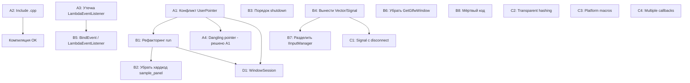

# План исправлений: SkifRmlUi Framework

**Дата**: 2026-03-01  
**Основа**: Архитектурный ревью `plans/review-architecture.md`, альтернативный подход `plans/review-alternative-approach.md`  
**Ветка**: `dev/skif-rmlui-framework`

---

## Текущее состояние проекта

Фреймворк SkifRmlUi реализует платформу для создания редакторов дизайна поверх GLFW/RmlUi/OpenGL. Завершены фазы 1-5 из 6 (Core, Plugins, Views, Layout, Input). Общая структура проекта — разделение на `include/` (публичные интерфейсы), `private/` (детали реализации), `src/` (исходники) — разумна и сохраняется. Система абстракций (IWindow, IPlugin, IView и т.д.) в целом правильная, но содержит ряд конкретных ошибок и архитектурных проблем, которые необходимо устранить.

## Цели исправлений

1. Устранить критические баги (UB, утечки памяти, нарушения сборки)
2. Привести архитектуру в согласованное состояние (убрать мёртвый код, исправить порядок инициализации)
3. Разделить ответственности (разбить God Object `App::run()`)
4. Подготовить к мультиоконности без полной реализации
5. Предпочесть современные идиомы C++20 устаревшим подходам там, где это уместно

## Что остаётся без изменений

| Компонент | Обоснование |
|-----------|-------------|
| Структура директорий `include/private/src` | Чистое разделение public/private API |
| Интерфейсы `IWindow`, `IWindowManager` | Работают, абстракция полезна для тестирования |
| Интерфейсы `IPlugin`, `IPluginRegistry` | Корректная декомпозиция |
| Интерфейсы `IView`, `IViewRegistry` | Хороший паттерн ViewDescriptor + Factory |
| `ViewHostImpl` | Работает корректно, нужны минимальные правки |
| `EventLoopImpl` | Работает, нужны минимальные расширения |
| `WindowImpl`, `WindowManagerImpl` | Работают корректно |
| Pimpl в `App` | Правильное скрытие деталей |
| Namespace `skif::rmlui` | Правильная организация |
| CMake с CPM | Хороший выбор |

---

## Группа A: Критические ошибки

### A1. Устранить конфликт `glfwSetWindowUserPointer`

**Проблема**: Два компонента перезаписывают друг друга. В `src/app.cpp:182` устанавливается `&window_state` (тип `WindowState*`), а в `src/implementation/input_manager_impl.cpp:48` — `this` (тип `InputManagerImpl*`). Поскольку `SetWindow()` вызывается на строке `app.cpp:219` **после** установки `window_state`, user pointer перезаписывается. При вызове `FramebufferSizeCallback` или `WindowRefreshCallback` происходит `static_cast<WindowState*>` от `InputManagerImpl*` — это **undefined behavior**.

**Затрагиваемые файлы**:
- `projects/lib/skif-rmlui/src/app.cpp` — строки 170-219
- `projects/lib/skif-rmlui/src/implementation/input_manager_impl.cpp` — строки 20-50
- `projects/lib/skif-rmlui/private/implementation/input_manager_impl.hpp`

**Что сделать**:

1. Создать единую структуру `WindowContext` в `private/implementation/window_context.hpp`:

```cpp
#pragma once

struct GLFWwindow;
struct GladGLContext;
namespace Rml { class Context; }

namespace skif::rmlui
{
class InputManagerImpl;

/// Единый контекст окна для GLFW user pointer.
/// Агрегирует все указатели, нужные в GLFW callbacks.
struct WindowContext
{
    GladGLContext*     gl            = nullptr;
    Rml::Context*     rml_context   = nullptr;
    InputManagerImpl* input_manager = nullptr;
};

} // namespace skif::rmlui
```

2. В `app.cpp` заменить локальную `WindowState` на `WindowContext`, сделав его членом `App::Impl`:

```cpp
// В struct App::Impl добавить:
WindowContext window_context;
```

3. В `app.cpp:170-219` убрать локальную `WindowState`, использовать `pimpl_->window_context`:

```cpp
pimpl_->window_context.gl = pimpl_->gl.get();
glfwSetWindowUserPointer(window->GetGlfwWindow(), &pimpl_->window_context);
```

4. В `InputManagerImpl::SetWindow()` (строка 48) **убрать** вызов `glfwSetWindowUserPointer(window_, this)`. Вместо этого в static callbacks получать `InputManagerImpl*` через `WindowContext`:

```cpp
void InputManagerImpl::KeyCallback(GLFWwindow* window, int key, int scancode, int action, int mods)
{
    auto* ctx = static_cast<WindowContext*>(glfwGetWindowUserPointer(window));
    if (!ctx || !ctx->input_manager) return;
    auto* self = ctx->input_manager;
    // ... остальной код без изменений
}
```

5. В `app.cpp` после создания `InputManagerImpl` установить указатель:

```cpp
pimpl_->window_context.input_manager = static_cast<InputManagerImpl*>(pimpl_->input_manager.get());
```

6. После создания `Rml::Context` обновить:

```cpp
pimpl_->window_context.rml_context = pimpl_->context;
```

**Зависимости**: Нет.

**Критерий приёмки**: При resize окна не происходит crash. `FramebufferSizeCallback`, `WindowRefreshCallback` и все input callbacks корректно получают свои данные через единый `WindowContext`.

---

### A2. Исправить `#include "plugins/sample_panel.cpp"`

**Проблема**: В `projects/bin/rmlui-app/main.cpp:3` включается `.cpp` файл. Это нарушает ODR, делает невозможной инкрементальную компиляцию и не масштабируется.

**Затрагиваемые файлы**:
- `projects/bin/rmlui-app/main.cpp` — строка 3
- `projects/bin/rmlui-app/CMakeLists.txt` — строка 7

**Что сделать**:

1. В `main.cpp` заменить `#include "plugins/sample_panel.cpp"` на `#include "plugins/sample_panel.hpp"`.

2. В `CMakeLists.txt` добавить `sample_panel.cpp` в `target_sources`:

```cmake
target_sources(${target} PRIVATE
    main.cpp
    plugins/sample_panel.cpp
)
```

**Зависимости**: Нет.

**Критерий приёмки**: Проект компилируется. `sample_panel.cpp` компилируется как отдельная translation unit.

---

### A3. Исправить утечку памяти в `LambdaEventListener`

**Проблема**: В `projects/bin/rmlui-app/plugins/sample_panel.cpp:74-80` создаётся `new LambdaEventListener(...)` без механизма удаления. RmlUi `AddEventListener` не берёт ownership по умолчанию.

**Затрагиваемые файлы**:
- `projects/bin/rmlui-app/plugins/sample_panel.cpp` — класс `LambdaEventListener` (строки 20-40)

**Что сделать**:

Добавить метод `OnDetach` в `LambdaEventListener` для самоудаления:

```cpp
class LambdaEventListener : public Rml::EventListener
{
public:
    using Callback = std::function<void(Rml::Event&)>;
    
    explicit LambdaEventListener(Callback callback)
        : callback_(std::move(callback))
    {}
    
    void ProcessEvent(Rml::Event& event) override
    {
        if (callback_) callback_(event);
    }
    
    void OnDetach(Rml::Element* /*element*/) override
    {
        delete this;
    }
    
private:
    Callback callback_;
};
```

**Примечание**: `LambdaEventListener` — полезный utility-класс. В дальнейшем (задача B5) он будет перенесён в библиотеку `skif-rmlui`.

**Зависимости**: Нет.

**Критерий приёмки**: При закрытии документа или удалении элемента `LambdaEventListener` корректно удаляется. Нет утечек памяти (проверить через sanitizer или Valgrind).

---

### A4. Исправить dangling pointer на стековую `WindowState`

**Проблема**: `WindowState window_state` в `app.cpp:177` — локальная переменная на стеке `run()`. Она передаётся в GLFW callbacks через user pointer. Хотя `run()` не завершается до конца event loop, это хрупкий дизайн.

**Затрагиваемые файлы**:
- `projects/lib/skif-rmlui/src/app.cpp` — строки 170-182

**Что сделать**: Эта задача **полностью решается задачей A1** — `WindowContext` становится членом `App::Impl`, а не локальной переменной.

**Зависимости**: A1.

**Критерий приёмки**: `WindowContext` является членом `App::Impl`, его lifetime совпадает с lifetime `App`.

---

## Группа B: Архитектурные улучшения

### B1. Рефакторинг `App::run()` — разбить на методы

**Проблема**: `App::run()` содержит 260+ строк монолитной инициализации. Это нарушает SRP и затрудняет понимание, отладку и тестирование.

**Затрагиваемые файлы**:
- `projects/lib/skif-rmlui/src/app.cpp` — метод `run()` (строки 121-387)
- `projects/lib/skif-rmlui/include/skif/rmlui/app.hpp` — при необходимости добавить private методы

**Что сделать**:

Разбить `run()` на приватные методы в `App::Impl` (не в публичном `App`, чтобы не загрязнять API):

```cpp
struct App::Impl
{
    // ... существующие поля ...
    
    // Методы инициализации
    bool InitializeGL(IWindow& window);
    bool InitializeRmlUi(IWindow& window);
    bool LoadFonts();
    void SetupGlfwCallbacks(IWindow& window);
    void SetupEventLoopCallbacks(IWindow& window);
    void StartPluginsAndViews();
    void Cleanup(std::shared_ptr<IWindow>& window);
};
```

Тогда `run()` станет:

```cpp
App::Return_Code App::run()
{
    if (!pimpl_->window_manager->Initialize()) return EXIT_FAILURE;
    if (!pimpl_->plugin_manager->Initialize()) { /* cleanup */ return EXIT_FAILURE; }
    
    auto window = pimpl_->window_manager->CreateWindow(pimpl_->config);
    if (!window) { /* cleanup */ return EXIT_FAILURE; }
    
    if (!pimpl_->InitializeGL(*window)) { /* cleanup */ return EXIT_FAILURE; }
    if (!pimpl_->InitializeRmlUi(*window)) { /* cleanup */ return EXIT_FAILURE; }
    
    pimpl_->LoadFonts();
    pimpl_->SetupGlfwCallbacks(*window);
    pimpl_->StartPluginsAndViews();
    pimpl_->SetupEventLoopCallbacks(*window);
    
    pimpl_->event_loop->Run();
    pimpl_->Cleanup(window);
    
    return EXIT_SUCCESS;
}
```

**Зависимости**: A1 (WindowContext должен быть в Impl).

**Критерий приёмки**: `App::run()` не превышает 30-40 строк. Каждый приватный метод имеет одну ответственность. Поведение приложения не изменилось.

---

### B2. Убрать хардкод `"sample_panel"` из фреймворка

**Проблема**: В `app.cpp:282-283` фреймворк знает о конкретном плагине:

```cpp
pimpl_->view_host->AttachView("sample_panel", nullptr);
pimpl_->view_host->ShowView("sample_panel");
```

Фреймворк не должен знать о конкретных плагинах. Решение о том, какие view показывать, должно приниматься на уровне приложения.

**Затрагиваемые файлы**:
- `projects/lib/skif-rmlui/src/app.cpp` — строки 280-314
- `projects/lib/skif-rmlui/include/skif/rmlui/app.hpp` — добавить метод конфигурации
- `projects/bin/rmlui-app/main.cpp` — перенести логику сюда

**Что сделать**:

1. Добавить в `App` метод для установки начального view:

```cpp
// В app.hpp
void SetInitialView(std::string_view view_name);
void SetFallbackRml(std::string_view rml_path);
```

2. Убрать из `app.cpp` строки 280-314 (хардкод `sample_panel` и fallback `basic.rml`).

3. В `main.cpp` перенести логику:

```cpp
int main(int argc, char* argv[])
{
    using namespace skif::rmlui;
    
    App app{argc, argv};
    app.GetPluginManager().RegisterPlugin(std::make_unique<sample::SamplePanelPlugin>());
    app.SetInitialView("sample_panel");
    app.SetFallbackRml("assets/ui/basic.rml");
    
    return app.run();
}
```

4. В `App::run()` (или в `StartPluginsAndViews()` после рефакторинга B1) использовать сохранённые значения:

```cpp
void App::Impl::StartPluginsAndViews()
{
    plugin_manager->StartPlugins();
    
    if (!initial_view_name.empty())
    {
        view_host->AttachView(initial_view_name, nullptr);
        view_host->ShowView(initial_view_name);
    }
    
    if (!view_host->GetActiveView() && !fallback_rml_path.empty())
    {
        auto* doc = context->LoadDocument(fallback_rml_path.c_str());
        if (doc) doc->Show();
    }
}
```

**Зависимости**: B1 (рефакторинг run).

**Критерий приёмки**: В `src/app.cpp` нет строки `"sample_panel"`. Фреймворк не знает о конкретных плагинах. Приложение работает как раньше.

---

### B3. Исправить порядок shutdown

**Проблема**: В `app.cpp:358-384` плагины останавливаются **после** `Rml::Shutdown()`. Если плагин в `OnUnload()` обращается к RmlUi — UB.

Текущий порядок:
1. `OnExit` → `Rml::Shutdown()` (строка 373)
2. После `Run()` → `plugin_manager->Shutdown()` → `StopPlugins()` → `OnUnload()` (строка 382)

Правильный порядок:
1. `StopPlugins()` → `OnUnload()` для всех плагинов
2. `Rml::Shutdown()`
3. Остальная очистка

**Затрагиваемые файлы**:
- `projects/lib/skif-rmlui/src/app.cpp` — строки 358-384

**Что сделать**:

Переместить `plugin_manager->StopPlugins()` **перед** `Rml::Shutdown()`:

```cpp
pimpl_->event_loop->OnExit(
    [this]()
    {
        // 1. Сначала останавливаем плагины (они могут обращаться к RmlUi)
        pimpl_->plugin_manager->StopPlugins();
        
        // 2. Затем очищаем RmlUi
        Rml::SetRenderInterface(nullptr);
        if (pimpl_->context)
        {
            Rml::RemoveContext(pimpl_->context->GetName());
        }
        Rml::Shutdown();
        pimpl_->render_impl.reset();
    }
);

// После Run():
pimpl_->plugin_manager->Shutdown(); // Теперь только очистка, StopPlugins уже вызван
pimpl_->window_manager->DestroyWindow(window);
pimpl_->window_manager->Shutdown();
```

**Примечание**: `PluginManagerImpl::Shutdown()` вызывает `StopPlugins()` внутри. Нужно убедиться, что повторный вызов `StopPlugins()` безопасен (он уже проверяет `entry.started`).

**Зависимости**: Нет.

**Критерий приёмки**: Плагины получают `OnUnload()` до `Rml::Shutdown()`. Повторный вызов `StopPlugins()` не вызывает проблем.

---

### B4. Вынести `Vector2i`, `Vector2f`, `Signal` в отдельные заголовки

**Проблема**: Математические типы и `Signal` определены в несвязанных заголовках:
- `Vector2i` в `include/skif/rmlui/core/i_window.hpp:14-21`
- `Vector2f` в `include/skif/rmlui/input/i_input_manager.hpp:20-27`
- `Signal` в `include/skif/rmlui/input/i_input_manager.hpp:32-53`

**Затрагиваемые файлы**:
- Создать: `include/skif/rmlui/core/math_types.hpp`
- Создать: `include/skif/rmlui/core/signal.hpp`
- Изменить: `include/skif/rmlui/core/i_window.hpp` — убрать `Vector2i`, добавить `#include`
- Изменить: `include/skif/rmlui/input/i_input_manager.hpp` — убрать `Vector2f` и `Signal`, добавить `#include`

**Что сделать**:

1. Создать `include/skif/rmlui/core/math_types.hpp`:

```cpp
#pragma once

namespace skif::rmlui
{

struct Vector2i
{
    int x = 0;
    int y = 0;
    constexpr Vector2i() noexcept = default;
    constexpr Vector2i(int x, int y) noexcept : x(x), y(y) {}
};

struct Vector2f
{
    float x = 0.0f;
    float y = 0.0f;
    constexpr Vector2f() noexcept = default;
    constexpr Vector2f(float x, float y) noexcept : x(x), y(y) {}
};

} // namespace skif::rmlui
```

2. Создать `include/skif/rmlui/core/signal.hpp` с улучшенной реализацией (см. задачу C1).

3. В `i_window.hpp` заменить определение `Vector2i` на `#include <skif/rmlui/core/math_types.hpp>`.

4. В `i_input_manager.hpp` заменить определения `Vector2f` и `Signal` на соответствующие `#include`.

5. Обновить все файлы, которые используют эти типы, если нужно.

**Зависимости**: C1 (Signal с disconnect) — можно делать параллельно, сначала просто перенести Signal как есть, потом улучшить.

**Критерий приёмки**: `Vector2i`, `Vector2f` и `Signal` определены каждый в одном месте. Все файлы компилируются.

---

### B5. Реализовать `IView::BindEvent()` или убрать из интерфейса

**Проблема**: `IView::BindEvent()` объявлен в интерфейсе, но не реализован. Вместо него используется прямой `new LambdaEventListener`. Это создаёт путаницу.

**Затрагиваемые файлы**:
- `include/skif/rmlui/view/i_view.hpp` — строки 48-53
- `projects/bin/rmlui-app/plugins/sample_panel.cpp` — строки 132-141
- Создать: `include/skif/rmlui/core/lambda_event_listener.hpp` (или `view/event_binding.hpp`)

**Что сделать** (вариант: реализовать полноценно):

1. Перенести `LambdaEventListener` из `sample_panel.cpp` в библиотеку `skif-rmlui` как utility-класс:

```cpp
// include/skif/rmlui/view/lambda_event_listener.hpp
#pragma once

#include <RmlUi/Core/EventListener.h>
#include <functional>

namespace skif::rmlui
{

class LambdaEventListener final : public Rml::EventListener
{
public:
    using Callback = std::function<void(Rml::Event&)>;
    
    explicit LambdaEventListener(Callback callback)
        : callback_(std::move(callback))
    {}
    
    void ProcessEvent(Rml::Event& event) override
    {
        if (callback_) callback_(event);
    }
    
    void OnDetach(Rml::Element*) override
    {
        delete this;
    }
    
private:
    Callback callback_;
};

} // namespace skif::rmlui
```

2. Реализовать `BindEvent` в базовом классе (или предоставить default implementation):

Вариант A — убрать `BindEvent` из `IView` и предоставить свободную функцию:

```cpp
// В lambda_event_listener.hpp
namespace skif::rmlui
{
inline void BindEvent(
    Rml::Element* element,
    std::string_view event_name,
    std::function<void(Rml::Event&)> handler)
{
    if (element)
    {
        element->AddEventListener(
            Rml::String(event_name),
            new LambdaEventListener(std::move(handler))
        );
    }
}
} // namespace skif::rmlui
```

Вариант B — оставить в `IView` как non-virtual метод с реализацией по умолчанию. Выбор за исполнителем, но вариант A проще и гибче.

3. Обновить `sample_panel.cpp` — использовать `skif::rmlui::BindEvent()` вместо прямого `new LambdaEventListener`.

4. Если выбран вариант A — убрать `BindEvent` из `IView` и `SamplePanelView`.

**Зависимости**: A3 (исправление утечки в LambdaEventListener).

**Критерий приёмки**: `LambdaEventListener` определён в одном месте в библиотеке. `BindEvent` работает и используется в sample plugin. Нет мёртвого кода в `IView`.

---

### B6. Убрать `GetGlfwWindow()` из публичного `IWindow`

**Проблема**: `IWindow::GetGlfwWindow()` экспонирует GLFW-специфичный тип в публичном API, что нарушает абстракцию.

**Затрагиваемые файлы**:
- `include/skif/rmlui/core/i_window.hpp` — строка 69
- `src/app.cpp` — все вызовы `GetGlfwWindow()`
- `private/implementation/window_impl.hpp`

**Что сделать**:

1. Убрать `GetGlfwWindow()` из `IWindow`.

2. Убрать forward declaration `struct GLFWwindow` из `i_window.hpp`.

3. Добавить `GetGlfwWindow()` в `WindowImpl` (private header) — он уже там есть.

4. В `app.cpp` использовать `static_cast<WindowImpl*>` или `dynamic_cast` для доступа к GLFW-специфичным методам. Поскольку `app.cpp` — это internal code, он имеет доступ к `WindowImpl`:

```cpp
// В app.cpp уже включён window_impl.hpp
auto* glfw_window = static_cast<WindowImpl&>(*window).GetGlfwWindow();
```

Или лучше — добавить helper в `App::Impl`:

```cpp
GLFWwindow* GetGlfwWindow(IWindow& window)
{
    return static_cast<WindowImpl&>(window).GetGlfwWindow();
}
```

**Зависимости**: Нет.

**Критерий приёмки**: В `include/skif/rmlui/core/i_window.hpp` нет упоминания `GLFWwindow`. Публичный API не зависит от GLFW.

---

### B7. Разделить `IInputManager` на публичный и внутренний

**Проблема**: `IInputManager` содержит как пользовательские методы (`IsKeyDown`, `GetMousePosition`), так и внутренние (`SetWindow`, `SetContext`, `Update`), а также data members (`Signal`).

**Затрагиваемые файлы**:
- `include/skif/rmlui/input/i_input_manager.hpp`
- `private/implementation/input_manager_impl.hpp`
- `src/app.cpp`

**Что сделать**:

1. Оставить в публичном `IInputManager` только пользовательские методы:

```cpp
class IInputManager
{
public:
    virtual ~IInputManager() = default;
    
    // Keyboard
    [[nodiscard]] virtual bool IsKeyDown(KeyCode key) const = 0;
    [[nodiscard]] virtual bool IsKeyPressed(KeyCode key) const = 0;
    
    // Mouse
    [[nodiscard]] virtual Vector2f GetMousePosition() const = 0;
    [[nodiscard]] virtual Vector2f GetMouseDelta() const = 0;
    [[nodiscard]] virtual bool IsMouseButtonDown(MouseButton button) const = 0;
    [[nodiscard]] virtual float GetMouseWheel() const = 0;
};
```

2. Убрать `Signal` data members из интерфейса. Сигналы — деталь реализации `InputManagerImpl`.

3. Убрать `SetWindow`, `SetContext`, `Update`, `Inject*` из публичного интерфейса. Они остаются в `InputManagerImpl` напрямую.

4. В `app.cpp` для вызова `SetWindow`/`SetContext`/`Update` использовать `InputManagerImpl&` напрямую (app.cpp уже включает `input_manager_impl.hpp`).

5. Убрать forward declaration `struct GLFWwindow` из `i_input_manager.hpp`.

**Зависимости**: B4 (вынос Signal в отдельный файл).

**Критерий приёмки**: Публичный `IInputManager` не содержит GLFW-зависимостей, data members и внутренних методов. Пользователь фреймворка видит только query-методы.

---

### B8. Удалить мёртвый код

**Проблема**: Несколько элементов не используются:
- `include/skif/rmlui/config.hpp` — пустая структура `Config`
- `LayoutEngine` — не подключён в `App`

**Затрагиваемые файлы**:
- `include/skif/rmlui/config.hpp`
- Все файлы, включающие `config.hpp`

**Что сделать**:

1. **`Config`**: Заменить содержимое `config.hpp` на forward declarations или общие типы, которые реально используются. Если ничего не нужно — удалить файл и убрать `#include` из всех заголовков.

   Альтернатива: использовать `config.hpp` для платформенных макросов (`SKIF_PLATFORM_WINDOWS` и т.д.), которые описаны в `architecture.md`, но не реализованы. Это полезнее пустой структуры.

2. **`LayoutEngine`**: Не удалять, но добавить в `App::Impl` и подключить. Это задача для отдельного этапа (Группа D).

**Зависимости**: Нет.

**Критерий приёмки**: Нет пустых структур в публичном API. Каждый публичный заголовок содержит что-то полезное.

---

## Группа C: Качество кода и C++20

### C1. Улучшить `Signal` — добавить disconnect

**Проблема**: Текущий `Signal` не поддерживает отключение подписчиков, что ведёт к утечкам и dangling references.

**Затрагиваемые файлы**:
- Создать: `include/skif/rmlui/core/signal.hpp`
- Изменить: `private/implementation/input_manager_impl.hpp` — использовать новый Signal

**Что сделать**:

Реализовать `Signal` с connection handle:

```cpp
#pragma once

#include <cstdint>
#include <functional>
#include <vector>
#include <algorithm>

namespace skif::rmlui
{

/// Handle для отключения подписки на сигнал
class Connection
{
public:
    Connection() = default;
    
    void Disconnect()
    {
        if (disconnect_fn_) disconnect_fn_();
    }
    
    [[nodiscard]] bool IsConnected() const { return disconnect_fn_ != nullptr; }

private:
    template<typename...> friend class Signal;
    std::function<void()> disconnect_fn_;
};

/// Сигнал с поддержкой disconnect
template<typename... Args>
class Signal
{
public:
    using Callback = std::function<void(Args...)>;
    
    Connection Connect(Callback callback)
    {
        const auto id = next_id_++;
        slots_.push_back({id, std::move(callback)});
        
        Connection conn;
        conn.disconnect_fn_ = [this, id]()
        {
            std::erase_if(slots_, [id](const Slot& s) { return s.id == id; });
        };
        return conn;
    }
    
    void operator()(Args... args) const
    {
        // Копируем на случай модификации во время итерации
        auto slots_copy = slots_;
        for (const auto& slot : slots_copy)
        {
            slot.callback(args...);
        }
    }
    
    void DisconnectAll() { slots_.clear(); }
    
    [[nodiscard]] bool Empty() const { return slots_.empty(); }

private:
    struct Slot
    {
        uint64_t id;
        Callback callback;
    };
    
    std::vector<Slot> slots_;
    uint64_t next_id_ = 0;
};

} // namespace skif::rmlui
```

**Зависимости**: B4 (вынос в отдельный файл).

**Критерий приёмки**: `Signal::Connect` возвращает `Connection`. `Connection::Disconnect()` корректно удаляет подписчика. Итерация по сигналу безопасна при модификации.

---

### C2. Использовать transparent hashing для `unordered_map`

**Проблема**: Во многих местах создаются временные `std::string` для lookup в `unordered_map`:

```cpp
auto it = plugins_.find(std::string(name));  // name — string_view
```

В C++20 можно использовать heterogeneous lookup.

**Затрагиваемые файлы**:
- `private/implementation/plugin_manager_impl.hpp`
- `private/implementation/view_registry_impl.hpp`
- `private/implementation/view_host_impl.hpp`
- Создать: `include/skif/rmlui/core/string_hash.hpp`

**Что сделать**:

1. Создать utility для transparent hashing:

```cpp
// include/skif/rmlui/core/string_hash.hpp
#pragma once

#include <string>
#include <string_view>
#include <functional>

namespace skif::rmlui
{

/// Transparent hash для std::string, поддерживающий lookup по string_view
struct StringHash
{
    using is_transparent = void;
    
    [[nodiscard]] std::size_t operator()(std::string_view sv) const noexcept
    {
        return std::hash<std::string_view>{}(sv);
    }
    
    [[nodiscard]] std::size_t operator()(const std::string& s) const noexcept
    {
        return std::hash<std::string>{}(s);
    }
};

/// Alias для unordered_map с transparent lookup
template<typename V>
using StringMap = std::unordered_map<std::string, V, StringHash, std::equal_to<>>;

} // namespace skif::rmlui
```

2. Заменить `std::unordered_map<std::string, ...>` на `StringMap<...>` в impl-файлах.

3. Убрать `std::string(name)` в вызовах `find()` — теперь можно передавать `string_view` напрямую.

**Зависимости**: Нет.

**Критерий приёмки**: Lookup в map по `string_view` не создаёт временных `std::string`. Все файлы компилируются.

---

### C3. Использовать `config.hpp` для платформенных макросов

**Проблема**: В `architecture.md` описаны макросы `SKIF_PLATFORM_WINDOWS`, `SKIF_COMPILER_MSVC` и т.д., но они не реализованы. `config.hpp` содержит пустую структуру.

**Затрагиваемые файлы**:
- `include/skif/rmlui/config.hpp`

**Что сделать**:

Заменить содержимое `config.hpp`:

```cpp
#pragma once

// Platform detection
#if defined(_WIN32) || defined(_WIN64)
    #define SKIF_PLATFORM_WINDOWS 1
#elif defined(__linux__)
    #define SKIF_PLATFORM_LINUX 1
#elif defined(__APPLE__)
    #define SKIF_PLATFORM_MACOS 1
#endif

// Compiler detection
#if defined(_MSC_VER)
    #define SKIF_COMPILER_MSVC 1
#elif defined(__clang__)
    #define SKIF_COMPILER_CLANG 1
#elif defined(__GNUC__)
    #define SKIF_COMPILER_GCC 1
#endif

// Plugin export/import
#if defined(SKIF_PLATFORM_WINDOWS)
    #if defined(SKIF_PLUGIN_EXPORTS)
        #define SKIF_PLUGIN_API __declspec(dllexport)
    #else
        #define SKIF_PLUGIN_API __declspec(dllimport)
    #endif
#else
    #if defined(SKIF_PLUGIN_EXPORTS)
        #define SKIF_PLUGIN_API __attribute__((visibility("default")))
    #else
        #define SKIF_PLUGIN_API
    #endif
#endif

#define SKIF_PLUGIN_EXPORT extern "C" SKIF_PLUGIN_API

namespace skif::rmlui
{
// Пустой namespace — placeholder для будущих глобальных типов
} // namespace skif::rmlui
```

**Зависимости**: Нет.

**Критерий приёмки**: `config.hpp` содержит платформенные и компиляторные макросы. Макросы корректно определяются на Windows/Linux/macOS.

---

### C4. Расширить `IEventLoop` — поддержка нескольких callbacks

**Проблема**: `IEventLoop` поддерживает только один callback каждого типа (`std::optional<Callback>`). Второй вызов `OnUpdate()` перезаписывает первый.

**Затрагиваемые файлы**:
- `include/skif/rmlui/core/i_event_loop.hpp` — строки 47-53
- `private/implementation/event_loop_impl.hpp` — строки 41-44
- `src/implementation/event_loop_impl.cpp`

**Что сделать**:

1. В `IEventLoop` изменить сигнатуру — `OnUpdate`/`OnRender`/`OnExit` должны **добавлять** callback, а не заменять:

```cpp
/// Добавить callback обновления (может быть несколько)
virtual void OnUpdate(UpdateCallback callback) = 0;

/// Добавить callback рендеринга (может быть несколько)
virtual void OnRender(RenderCallback callback) = 0;

/// Добавить callback выхода (может быть несколько)
virtual void OnExit(ExitCallback callback) = 0;
```

2. В `EventLoopImpl` заменить `std::optional<Callback>` на `std::vector<Callback>`:

```cpp
std::vector<UpdateCallback> update_callbacks_;
std::vector<RenderCallback> render_callbacks_;
std::vector<ExitCallback>   exit_callbacks_;
```

3. В `Run()` вызывать все callbacks:

```cpp
for (const auto& cb : update_callbacks_) cb(delta_time_);
for (const auto& cb : render_callbacks_) cb();
```

**Зависимости**: Нет.

**Критерий приёмки**: Можно зарегистрировать несколько `OnUpdate` callbacks. Все вызываются в порядке регистрации.

---

## Группа D: Подготовка к мультиоконности (без полной реализации)

### D1. Подготовить архитектуру к per-window контекстам

**Проблема**: Текущая архитектура привязана к единственному `Rml::Context`, одному `InputManager` и одному `ViewHost`. Для мультиоконности каждое окно должно иметь свой набор.

**Что сделать** (минимальные изменения, без полной реализации):

1. Ввести концепцию `WindowSession` — структура, объединяющая всё, что привязано к одному окну:

```cpp
// private/implementation/window_session.hpp
struct WindowSession
{
    std::shared_ptr<IWindow>       window;
    std::unique_ptr<WindowContext>  context;      // GLFW user pointer data
    Rml::Context*                   rml_context = nullptr;
    std::unique_ptr<IViewHost>      view_host;
    // InputManager пока один на всё приложение
};
```

2. В `App::Impl` заменить отдельные поля на `WindowSession` для главного окна:

```cpp
struct App::Impl
{
    // ... managers ...
    WindowSession main_session;  // вместо отдельных window, context, view_host
};
```

3. Это не меняет поведение, но делает очевидным, что эти компоненты привязаны к окну, и упрощает будущее добавление второго окна.

**Зависимости**: B1 (рефакторинг run), A1 (WindowContext).

**Критерий приёмки**: Код компилируется и работает как раньше. Компоненты, привязанные к окну, сгруппированы в `WindowSession`.

---

## Порядок выполнения



**Рекомендуемый порядок**:

1. **A1** → **A2** → **A3** (критические, можно параллельно)
2. **B3** (порядок shutdown — быстрое исправление)
3. **B4** (вынос типов — подготовка к B7)
4. **B1** (рефакторинг run — основная работа)
5. **B2** (убрать хардкод — после B1)
6. **B5** (BindEvent — после A3)
7. **B6**, **B7** (очистка API — можно параллельно)
8. **C1**, **C2**, **C3**, **C4** (качество кода — можно параллельно)
9. **B8** (мёртвый код — в конце)
10. **D1** (подготовка к мультиоконности — в конце)

---

## Критерии общей приёмки

1. Проект компилируется без warnings на `-Wall -Wextra` (GCC/Clang) или `/W4` (MSVC)
2. Приложение запускается, показывает sample_panel, кнопки работают
3. Resize окна не вызывает crash
4. Нет утечек памяти (проверить sanitizer)
5. В публичных заголовках нет зависимостей от GLFW
6. В `src/app.cpp` нет хардкода имён плагинов
7. `App::run()` не превышает 40 строк
