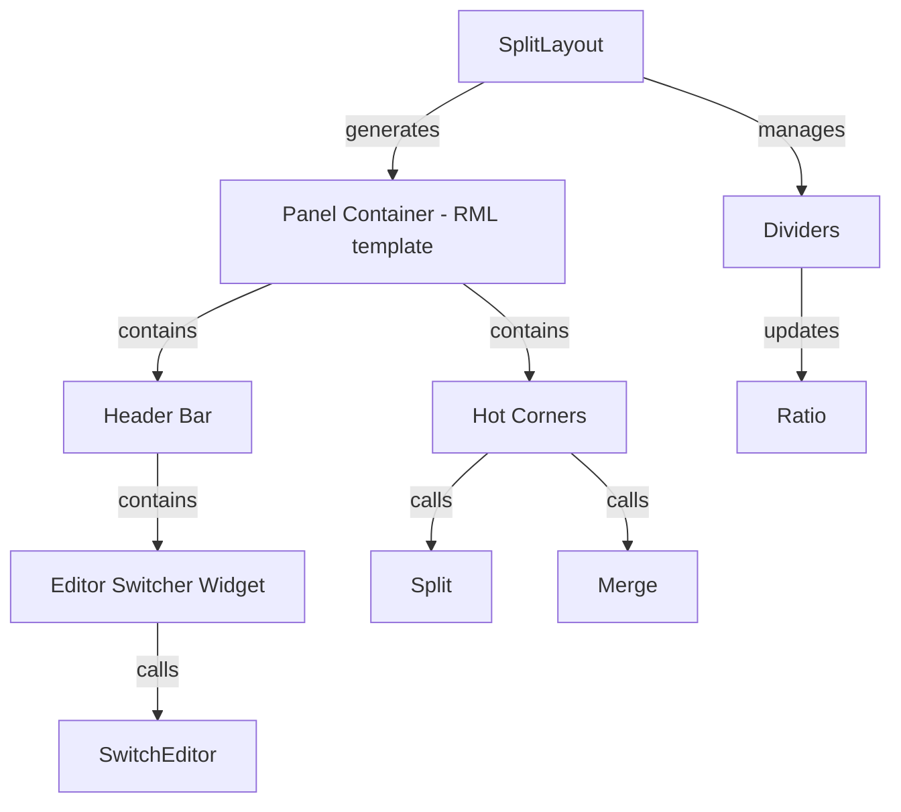
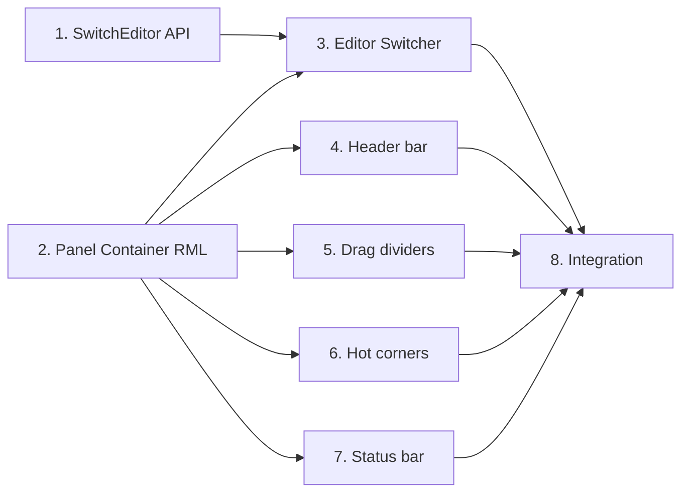

# Phase 2: Интерактивный Layout — Blender-подобные панели

## Обзор

Каждая панель в SplitLayout должна быть обёрнута в **Panel Container** — стандартный RML-шаблон, который предоставляет:
1. **Header bar** — меню редактора + виджет переключения типа редактора
2. **Content area** — область для RML документа редактора
3. **Status bar** (опционально) — нижняя строка состояния
4. **Горячие углы** — drag-зоны для split/merge
5. **Drag разделители** — изменение пропорций между панелями

## Визуальная структура панели

```
┌─────────────────────────────────────────────┐
│ [▼ Editor Type] │ Menu Item 1 │ Menu Item 2 │  ← Header bar
├─────────────────────────────────────────────┤
│                                             │
│           Editor Content Area               │  ← RML документ редактора
│           (sample_panel.rml)                │
│                                             │
├─────────────────────────────────────────────┤
│ Status: Ready                               │  ← Status bar (опционально)
└─────────────────────────────────────────────┘
```

## Горячие углы и разделители

```
┌──┬─────────────────────────┬──┐
│◤ │      Header bar         │◥ │  ← Углы: drag для split
├──┼─────────────────────────┼──┤
│  │                         │  │
│  │    Content Area         │  │
│  │                         │  │
├──┼─────────────────────────┼──┤
│◣ │      Status bar         │◢ │  ← Углы: drag для merge
└──┴─────────────────────────┴──┘
```

- **◤◥** (верхние углы) — потянуть → split панели
- **◣◢** (нижние углы) — потянуть на соседнюю панель → merge
- **Разделитель между панелями** — drag для изменения ratio

## Архитектура

### Новые компоненты



### Panel Container RML шаблон

Каждый leaf-узел SplitLayout генерирует следующий RML:

```xml
<div class="panel-container" data-instance="sample_panel_0x1234">
    <!-- Header bar -->
    <div class="panel-header">
        <!-- Editor switcher dropdown -->
        <select class="editor-switcher" data-instance="sample_panel_0x1234">
            <option value="sample_panel" selected>Sample Panel</option>
            <option value="properties">Properties</option>
            <option value="timeline">Timeline</option>
        </select>
        
        <!-- Editor menu entries -->
        <div class="panel-menu">
            <button class="menu-item" data-action="sample.increment">Increment</button>
            <button class="menu-item" data-action="sample.reset">Reset (Ctrl+R)</button>
        </div>
    </div>
    
    <!-- Hot corners -->
    <div class="hot-corner top-left" data-action="split-horizontal"></div>
    <div class="hot-corner top-right" data-action="split-vertical"></div>
    
    <!-- Content area - здесь загружается RML редактора -->
    <div class="panel-content" data-instance="sample_panel_0x1234">
        <!-- Editor RML document вставляется сюда -->
    </div>
    
    <!-- Status bar (опционально) -->
    <div class="panel-statusbar">
        <span class="status-text">Ready</span>
    </div>
    
    <!-- Bottom hot corners -->
    <div class="hot-corner bottom-left" data-action="merge"></div>
    <div class="hot-corner bottom-right" data-action="merge"></div>
</div>
```

### Разделители между панелями

```xml
<div class="split-container" data-direction="horizontal" data-ratio="0.7">
    <div class="split-panel split-first" style="width: 70%;">
        <!-- Panel Container 1 -->
    </div>
    
    <div class="split-divider" data-direction="horizontal">
        <!-- Drag handle -->
    </div>
    
    <div class="split-panel split-second" style="width: 30%;">
        <!-- Panel Container 2 -->
    </div>
</div>
```

### CSS стили

```css
/* Panel Container */
.panel-container {
    display: flex;
    flex-direction: column;
    width: 100%;
    height: 100%;
    background-color: #2a2a2a;
    border: 1px solid #444;
}

/* Header bar */
.panel-header {
    display: flex;
    align-items: center;
    height: 28px;
    background-color: #333;
    border-bottom: 1px solid #444;
    padding: 0 4px;
    gap: 4px;
}

/* Editor switcher */
.editor-switcher {
    min-width: 120px;
    height: 22px;
    background-color: #444;
    color: #ddd;
    border: 1px solid #555;
    font-size: 11px;
}

/* Menu items */
.panel-menu {
    display: flex;
    gap: 2px;
}

.menu-item {
    padding: 2px 8px;
    background-color: transparent;
    color: #aaa;
    border: none;
    font-size: 11px;
}

.menu-item:hover {
    background-color: #4a9eff;
    color: #fff;
}

/* Content area */
.panel-content {
    flex: 1;
    overflow: auto;
}

/* Status bar */
.panel-statusbar {
    height: 22px;
    background-color: #333;
    border-top: 1px solid #444;
    padding: 0 8px;
    display: flex;
    align-items: center;
}

.status-text {
    font-size: 10px;
    color: #888;
}

/* Hot corners */
.hot-corner {
    position: absolute;
    width: 12px;
    height: 12px;
    z-index: 100;
}

.hot-corner.top-left { top: 0; left: 0; cursor: nw-resize; }
.hot-corner.top-right { top: 0; right: 0; cursor: ne-resize; }
.hot-corner.bottom-left { bottom: 0; left: 0; cursor: sw-resize; }
.hot-corner.bottom-right { bottom: 0; right: 0; cursor: se-resize; }

.hot-corner:hover {
    background-color: rgba(74, 158, 255, 0.3);
}

.hot-corner:active {
    background-color: rgba(74, 158, 255, 0.6);
}

/* Split divider */
.split-divider {
    background-color: #444;
    z-index: 50;
}

.split-divider[data-direction=horizontal] {
    width: 4px;
    cursor: col-resize;
}

.split-divider[data-direction=vertical] {
    height: 4px;
    cursor: row-resize;
}

.split-divider:hover {
    background-color: #4a9eff;
}
```

## Новые/изменённые интерфейсы

### ISplitLayout — новые методы

```cpp
class ISplitLayout
{
public:
    // ... существующие методы ...
    
    /// Переключить тип редактора в панели
    virtual bool SwitchEditor(const SplitNode* panel, std::string_view new_editor_name) = 0;
    
    /// Начать drag разделителя
    virtual void BeginDividerDrag(const SplitNode* split_node) = 0;
    
    /// Обновить позицию drag
    virtual void UpdateDividerDrag(float position) = 0;
    
    /// Завершить drag
    virtual void EndDividerDrag() = 0;
    
    /// Начать split через горячий угол
    virtual void BeginCornerSplit(const SplitNode* panel, SplitDirection direction) = 0;
    
    /// Начать merge через горячий угол
    virtual void BeginCornerMerge(const SplitNode* panel) = 0;
};
```

### IEditor — опциональный status bar

```cpp
class IEditor
{
public:
    // ... существующие методы ...
    
    /// Получить текст статус бара (опционально)
    [[nodiscard]] virtual std::string_view GetStatusText() const noexcept
    {
        return {};  // По умолчанию — пустой
    }
};
```

### PanelContainerController — новый класс

```cpp
/// Контроллер UI панели — управляет header bar, editor switcher, hot corners
class PanelContainerController
{
public:
    PanelContainerController(
        ISplitLayout& layout,
        IEditorRegistry& registry,
        const SplitNode* node,
        Rml::Element* container_element
    );
    
    /// Обновить dropdown со списком редакторов
    void UpdateEditorSwitcher();
    
    /// Обновить меню из EditorDescriptor
    void UpdateMenu();
    
    /// Обновить status bar
    void UpdateStatusBar();
    
    /// Обработать выбор нового редактора в dropdown
    void OnEditorSelected(std::string_view editor_name);
    
    /// Обработать drag горячего угла
    void OnHotCornerDrag(HotCornerPosition position, float dx, float dy);
};
```

## План реализации

### Шаг 1: SwitchEditor API
- [ ] Добавить `SwitchEditor` в `ISplitLayout`
- [ ] Реализовать в `SplitLayoutImpl` — destroy old, update node, create new
- [ ] Тест: программное переключение из main.cpp

### Шаг 2: Panel Container RML шаблон
- [ ] Создать `assets/ui/panel_container.rml` — базовый шаблон
- [ ] Создать `assets/ui/panel_styles.rcss` — стили
- [ ] Обновить `SplitLayoutImpl::GenerateRML()` — генерировать panel container вокруг каждого leaf

### Шаг 3: Editor Switcher
- [ ] Создать `PanelContainerController` — C++ логика для panel container
- [ ] Реализовать dropdown с `IEditorRegistry::GetAllDescriptors()`
- [ ] Обработка `change` события → `SwitchEditor()`

### Шаг 4: Header bar с меню
- [ ] Генерировать menu items из `EditorDescriptor::menu_entries`
- [ ] Обработка кликов по menu items
- [ ] Связь с Command System (будущее)

### Шаг 5: Drag разделителей
- [ ] Обработка mousedown/mousemove/mouseup на `.split-divider`
- [ ] Обновление `ratio` в `SplitNode`
- [ ] Пересчёт размеров панелей через CSS

### Шаг 6: Горячие углы
- [ ] Обработка drag на `.hot-corner`
- [ ] Определение направления split по вектору drag
- [ ] Визуальная индикация (подсветка зоны split)
- [ ] Merge: определение целевой панели

### Шаг 7: Status bar
- [ ] Добавить `GetStatusText()` в `IEditor` (с default реализацией)
- [ ] Обновлять status bar каждый кадр из `PanelContainerController`

### Шаг 8: Интеграция
- [ ] Обновить `SplitLayoutImpl::Initialize()` — создавать `PanelContainerController` для каждого leaf
- [ ] Обновить `SplitLayoutImpl::Update()` — обновлять контроллеры
- [ ] Обновить `App` — подключить обработку событий

## Зависимости



Шаги 1 и 2 — независимые, можно делать параллельно.
Шаги 3-7 зависят от шага 2 (RML шаблон).
Шаг 8 — финальная интеграция.
