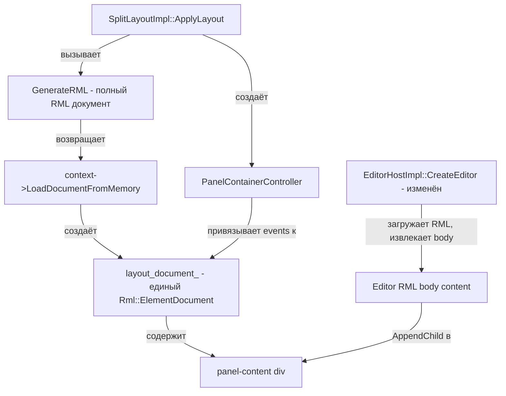

# Phase 2.5 — План реализации: Интерактивный Layout с загрузкой RML

## Проблема

Сейчас два механизма загрузки RML не связаны:

1. **`EditorHostImpl::CreateEditor()`** — загружает RML каждого Editor отдельно через `context->LoadDocument(rml_path)`. Каждый Editor получает свой `Rml::ElementDocument*`.

2. **`SplitLayoutImpl::GenerateRML()`** — генерирует RML-строку с panel container, но **только логирует** её в `ApplyLayout()` — не загружает в RmlUi context.

## Решение

Объединить механизмы: layout RML становится единым документом-контейнером, а Editor RML загружается внутрь `panel-content` div.

## Архитектура изменений



## Детальный план по шагам

### Шаг 1: Изменить `GenerateRML()` — генерировать полный RML документ

**Файл:** `split_layout_impl.cpp`

Сейчас `GenerateRML()` генерирует только body-контент. Нужно обернуть в полный RML документ с `<head>` и подключением стилей.

```xml
<rml>
<head>
    <title>Layout</title>
    <link type="text/rcss" href="assets/ui/panel_container.rcss"/>
    <style>
        body {
            width: 100%;
            height: 100%;
            margin: 0;
            padding: 0;
            font-family: IBM Plex Mono;
            font-size: 14dp;
        }
    </style>
</head>
<body>
    <!-- Сгенерированное дерево split-контейнеров и panel-контейнеров -->
</body>
</rml>
```

### Шаг 2: Изменить `ApplyLayout()` — загружать RML в context

**Файл:** `split_layout_impl.cpp`, `split_layout_impl.hpp`

Вместо логирования — реально загружать документ:

```cpp
void SplitLayoutImpl::ApplyLayout()
{
    if (!context_ || !root_) return;

    // Закрыть предыдущий layout документ
    if (layout_document_)
    {
        layout_document_->Close();
        layout_document_ = nullptr;
    }

    // Очистить контроллеры
    panel_controllers_.clear();

    std::string rml = GenerateRML();
    layout_document_ = context_->LoadDocumentFromMemory(rml, "layout");
    if (!layout_document_)
    {
        Rml::Log::Message(Rml::Log::LT_ERROR, "Failed to load layout RML");
        return;
    }

    // Загрузить Editor RML в panel-content
    LoadEditorContent(root_.get());

    // Создать PanelContainerController для каждого leaf
    SetupPanelControllers(root_.get());

    layout_document_->Show();
}
```

Добавить в `split_layout_impl.hpp`:
```cpp
Rml::ElementDocument* layout_document_ = nullptr;
std::vector<std::unique_ptr<PanelContainerController>> panel_controllers_;
```

### Шаг 3: Изменить `EditorHostImpl::CreateEditor()` — не загружать отдельный документ

**Файл:** `editor_host_impl.cpp`, `editor_host_impl.hpp`

Текущая реализация загружает RML как отдельный `ElementDocument`. Нужно изменить подход:

**Вариант A — EditorHost загружает RML и вставляет body-контент в panel-content:**

```cpp
bool EditorHostImpl::CreateEditor(
    std::string_view editor_name,
    std::string_view instance_id,
    Rml::Element* content_element)  // НОВЫЙ параметр
{
    // ... создать editor instance ...

    if (content_element)
    {
        // Загрузить RML как отдельный документ, извлечь body-контент
        Rml::ElementDocument* temp_doc = context_->LoadDocument(descriptor->rml_path.c_str());
        if (temp_doc)
        {
            // Перенести children из body temp_doc в content_element
            // Используем temp_doc->GetFirstChild() и AppendChild
            MoveChildren(temp_doc, content_element);
            temp_doc->Close();
        }

        // Передать content_element как document для OnCreated
        // Нужно передать layout_document_ чтобы GetElementById работал
        editor->OnCreated(content_element->GetOwnerDocument());
    }
    else
    {
        // Legacy: загрузить как отдельный документ
        Rml::ElementDocument* document = context_->LoadDocument(descriptor->rml_path.c_str());
        editor->OnCreated(document);
    }
}
```

**Проблема:** `OnCreated(document)` получает `ElementDocument*`, а `GetElementById` ищет по всему документу. Если несколько панелей в одном документе — ID будут конфликтовать.

**Вариант B (предпочтительный) — Загружать Editor RML как отдельный документ, скрыть его, и перенести контент:**

Лучший подход — загрузить Editor RML как временный документ, скопировать inner RML body в panel-content, закрыть временный документ. Но тогда event listeners не будут работать.

**Вариант C (рекомендуемый) — Использовать `SetInnerRML` для вставки контента:**

1. Прочитать RML файл как строку
2. Извлечь содержимое `<body>...</body>`
3. Вставить через `panel_content_element->SetInnerRML(body_content)`
4. Передать `layout_document_` в `OnCreated()` — editor привязывает listeners к элементам внутри panel-content

Это самый чистый подход, но требует парсинга RML файла для извлечения body.

**Вариант D (самый простой и надёжный) — Загружать Editor RML как отдельный скрытый документ, а в panel-content вставлять ссылку:**

Оставить текущий механизм загрузки Editor RML как отдельного документа, но:
- Скрыть его (`document->Hide()`)
- В panel-content вставить контент через `SetInnerRML` с содержимым body
- Editor получает `layout_document_` для работы с элементами

### Рекомендуемый подход: Вариант C с файловым чтением

1. `EditorHostImpl` читает RML файл, парсит body-контент
2. Вставляет body-контент в `panel-content` через `SetInnerRML`
3. Стили из `<style>` тега Editor RML вставляются в `<head>` layout документа
4. `OnCreated()` получает `layout_document_` — editor ищет элементы по ID в нём

### Шаг 4: Создать `PanelContainerController`

**Новые файлы:**
- `include/skif/rmlui/editor/panel_container_controller.hpp`
- `private/implementation/panel_container_controller_impl.hpp`
- `src/implementation/panel_container_controller_impl.cpp`

```cpp
class PanelContainerController
{
public:
    PanelContainerController(
        ISplitLayout& layout,
        IEditorHost& editor_host,
        IEditorRegistry& registry,
        const SplitNode* node,
        Rml::Element* container_element
    );

    ~PanelContainerController();

    /// Привязать event listeners к элементам panel container
    void BindEvents();

    /// Обновить status bar текст
    void UpdateStatusBar();

    /// Обновить editor switcher dropdown
    void UpdateEditorSwitcher();

private:
    void OnEditorSwitcherChange(Rml::Event& event);
    void OnHotCornerMouseDown(Rml::Event& event);
    void OnDividerMouseDown(Rml::Event& event);
    void OnMenuItemClick(Rml::Event& event);

    ISplitLayout& layout_;
    IEditorHost& editor_host_;
    IEditorRegistry& registry_;
    const SplitNode* node_;
    Rml::Element* container_;
};
```

**Привязка событий:**

```cpp
void PanelContainerController::BindEvents()
{
    // Editor switcher
    auto* switcher = container_->GetElementById("...");
    // Используем data-instance для поиска
    auto* switcher = container_->QuerySelector(".editor-switcher");
    BindEvent(switcher, "change", [this](Rml::Event& e) { OnEditorSwitcherChange(e); });

    // Hot corners
    auto hot_corners = container_->QuerySelectorAll(".hot-corner");
    for (auto* corner : hot_corners)
    {
        BindEvent(corner, "mousedown", [this](Rml::Event& e) { OnHotCornerMouseDown(e); });
    }

    // Menu items
    auto menu_items = container_->QuerySelectorAll(".menu-item");
    for (auto* item : menu_items)
    {
        BindEvent(item, "click", [this](Rml::Event& e) { OnMenuItemClick(e); });
    }
}
```

### Шаг 5: Обработка Divider Drag

**Файл:** `split_layout_impl.cpp`

Divider drag обрабатывается на уровне SplitLayout, не PanelContainerController:

```cpp
void SplitLayoutImpl::SetupDividerHandlers()
{
    if (!layout_document_) return;

    auto dividers = layout_document_->QuerySelectorAll(".split-divider");
    for (auto* divider : dividers)
    {
        BindEvent(divider, "mousedown", [this, divider](Rml::Event& event) {
            dragging_divider_ = divider;
            drag_start_pos_ = GetMousePosition(event);
            // Найти соответствующий SplitNode по data-атрибутам
        });
    }

    // mouseup/mousemove на document level
    BindEvent(layout_document_, "mousemove", [this](Rml::Event& event) {
        if (dragging_divider_) { UpdateDividerDrag(event); }
    });

    BindEvent(layout_document_, "mouseup", [this](Rml::Event& event) {
        if (dragging_divider_) { EndDividerDrag(); }
    });
}
```

### Шаг 6: Обновить `Initialize()` flow

**Файл:** `split_layout_impl.cpp`

```cpp
void SplitLayoutImpl::Initialize()
{
    if (!root_ || !editor_host_) return;

    // 1. Создать экземпляры редакторов (без загрузки RML)
    InitializeEditorsRecursive(root_.get());

    // 2. Сгенерировать и загрузить layout RML
    ApplyLayout();
    // ApplyLayout() внутри:
    //   - GenerateRML() → LoadDocumentFromMemory()
    //   - LoadEditorContent() → вставить body-контент каждого Editor в panel-content
    //   - SetupPanelControllers() → создать PanelContainerController для каждого leaf
    //   - SetupDividerHandlers() → привязать drag к dividers
}
```

### Шаг 7: Обеспечить обратную совместимость SampleEditor

**Проблема:** `SampleEditor::OnCreated(document)` использует `document->GetElementById("counter-value")`. Если контент вставлен через `SetInnerRML` в layout документ, то `GetElementById` должен искать в layout документе.

**Решение:** Передавать `layout_document_` в `OnCreated()`. Элементы с ID будут доступны через `layout_document_->GetElementById()`.

**Риск:** Если несколько экземпляров одного Editor — ID будут дублироваться. Для Phase 2.5 это допустимо (один экземпляр), но в будущем нужно будет использовать уникальные ID или scoped поиск.

### Шаг 8: Обновить CMakeLists.txt

Добавить новый файл `panel_container_controller_impl.cpp` в список исходников.

## Порядок реализации файлов

1. **`split_layout_impl.hpp`** — добавить `layout_document_`, `panel_controllers_`, новые методы
2. **`split_layout_impl.cpp`** — изменить `GenerateRML()`, `ApplyLayout()`, добавить `LoadEditorContent()`, `SetupPanelControllers()`, `SetupDividerHandlers()`
3. **`editor_host_impl.hpp`** — добавить перегрузку `CreateEditor()` с `Rml::Element*` параметром
4. **`editor_host_impl.cpp`** — реализовать новую перегрузку, добавить чтение RML файла и извлечение body
5. **`panel_container_controller_impl.hpp`** — новый файл
6. **`panel_container_controller_impl.cpp`** — новый файл
7. **`CMakeLists.txt`** — добавить новый source file
8. **Тестирование** — сборка и запуск

## Диаграмма потока данных при инициализации

```mermaid
sequenceDiagram
    participant App
    participant SplitLayout
    participant EditorHost
    participant EditorRegistry
    participant RmlUi
    participant PCC as PanelContainerController

    App->>SplitLayout: SetRoot + Initialize
    SplitLayout->>EditorHost: CreateEditor per leaf - создать экземпляры
    EditorHost->>EditorRegistry: CreateEditor - фабрика
    EditorRegistry-->>EditorHost: unique_ptr IEditor
    SplitLayout->>SplitLayout: GenerateRML - полный RML документ
    SplitLayout->>RmlUi: LoadDocumentFromMemory
    RmlUi-->>SplitLayout: layout_document_
    SplitLayout->>SplitLayout: LoadEditorContent per leaf
    SplitLayout->>EditorHost: LoadEditorRML - читает файл, вставляет body в panel-content
    SplitLayout->>SplitLayout: SetupPanelControllers
    SplitLayout->>PCC: new PanelContainerController per leaf
    PCC->>PCC: BindEvents - switcher, hot corners, menu
    SplitLayout->>SplitLayout: SetupDividerHandlers
    SplitLayout->>RmlUi: layout_document_->Show
    EditorHost->>EditorHost: editor->OnCreated - layout_document_
    EditorHost->>EditorHost: editor->OnActivate
