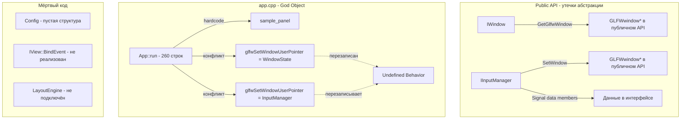

# Архитектурный ревью: SkifRmlUi Framework

**Дата**: 2026-02-28  
**Ревьюер**: Независимый архитектурный анализ  
**Ветка**: `dev/skif-rmlui-framework` (базовая: `master`)  
**Scope**: Публичные API заголовочных файлов, реализации, план архитектуры

---

## Резюме

Фреймворк SkifRmlUi — это платформа для создания редакторов дизайна поверх GLFW/RmlUi/OpenGL с системой плагинов и панелей в стиле Blender. Реализованы фазы 1-5 из 6. Общая идея архитектуры разумна, но реализация содержит ряд серьёзных проблем, которые необходимо устранить до того, как кодовая база станет сложнее.

**Общая оценка**: ⚠️ Требует существенной доработки перед продолжением разработки.

---

## 1. КРИТИЧЕСКИЕ ПРОБЛЕМЫ

### 1.1 Конфликт `glfwSetWindowUserPointer` — гонка за единственный ресурс

**Файлы**: `src/app.cpp:182`, `src/implementation/input_manager_impl.cpp:48`

Это **самая серьёзная проблема** в текущей реализации. Два компонента борются за один и тот же `glfwSetWindowUserPointer`:

```
app.cpp:182       → glfwSetWindowUserPointer(window, &window_state);  // WindowState*
input_manager.cpp:48 → glfwSetWindowUserPointer(window_, this);       // InputManagerImpl*
```

В `app.cpp:219` вызывается `SetWindow()` **после** установки `window_state`, что **перезаписывает** user pointer. В результате:
- `FramebufferSizeCallback` и `WindowRefreshCallback` из `app.cpp` получают `InputManagerImpl*` вместо `WindowState*` → **undefined behavior**, вероятный crash.
- Это работает «случайно» только если resize не происходит, или если компилятор расположил данные удачно.

**Рекомендация**: Создать единую структуру `WindowContext`, которая агрегирует все нужные указатели, и использовать её как единственный user pointer:

```cpp
struct WindowContext
{
    GladGLContext*    gl = nullptr;
    Rml::Context*     rml_context = nullptr;
    InputManagerImpl* input_manager = nullptr;
    // ... другие подсистемы
};
```

### 1.2 `#include "plugins/sample_panel.cpp"` — включение .cpp файла

**Файл**: `projects/bin/rmlui-app/main.cpp:3`

```cpp
#include "plugins/sample_panel.cpp"
```

Это грубое нарушение практик C++. Включение `.cpp` файла:
- Нарушает ODR при наличии нескольких translation units
- Делает невозможной инкрементальную компиляцию
- Путает инструменты анализа кода
- Не масштабируется при добавлении новых плагинов

**Рекомендация**: Добавить `sample_panel.cpp` в `target_sources()` в CMakeLists.txt и включать только `.hpp`.

### 1.3 Утечка памяти в `LambdaEventListener`

**Файл**: `projects/bin/rmlui-app/plugins/sample_panel.cpp:74-80`

```cpp
increment_btn->AddEventListener("click",
    new LambdaEventListener([this](Rml::Event& event) { ... })
);
```

`new` без соответствующего `delete`. RmlUi `AddEventListener` принимает raw pointer и **не берёт ownership** по умолчанию (третий параметр `in_front` — это bool, а не флаг ownership). Listener должен быть удалён вручную через `RemoveEventListener`, либо нужно переопределить `OnDetach()` в `LambdaEventListener` для самоудаления:

```cpp
void OnDetach(Rml::Element*) override { delete this; }
```

### 1.4 Dangling pointer на `WindowState` — стековая переменная в лямбдах

**Файл**: `src/app.cpp:177-216`

`WindowState window_state` — это **локальная переменная на стеке** функции `App::run()`. Она передаётся в GLFW callbacks через `glfwSetWindowUserPointer`. Пока `run()` выполняется, это работает. Но:
- Если архитектура изменится и callbacks будут вызываться после выхода из `run()` — UB
- `window_state.context` устанавливается в `nullptr` на строке 179, затем обновляется на строке 245. Между этими строками callbacks уже зарегистрированы и могут быть вызваны с `context == nullptr`

**Рекомендация**: Сделать `WindowState` членом `App::Impl` или выделить в heap.

---

## 2. СЕРЬЁЗНЫЕ АРХИТЕКТУРНЫЕ ПРОБЛЕМЫ

### 2.1 God Object: `App::run()` — 260+ строк монолитной инициализации

**Файл**: `src/app.cpp:121-387`

Метод `App::run()` содержит:
- Инициализацию WindowManager
- Инициализацию PluginManager
- Создание окна
- Загрузку OpenGL
- Настройку OpenGL state
- Регистрацию GLFW callbacks
- Инициализацию InputManager
- Инициализацию RmlUi
- Создание RmlUi контекста
- Создание ViewHost
- Загрузку шрифтов
- Запуск плагинов
- Хардкод загрузки `sample_panel`
- Fallback загрузку `basic.rml`
- Настройку event loop callbacks
- Запуск event loop
- Очистку

Это нарушает SRP и делает код нетестируемым. Каждый из этих шагов должен быть отдельным методом или отдельным компонентом.

**Особенно критично**: хардкод `"sample_panel"` на строке 282:
```cpp
pimpl_->view_host->AttachView("sample_panel", nullptr);
```
Фреймворк не должен знать о конкретных плагинах.

### 2.2 Отсутствие `IResourceManager` в реализации

В `architecture.md` описан `IResourceManager`, но в реализации его нет. Вместо этого в `App` есть примитивный `std::vector<std::string> resource_directories` и хардкод путей к шрифтам:

```cpp
// app.cpp:258
const std::string font_path = dir + "/fonts/IBM_Plex_Mono/IBMPlexMono-Regular.ttf";
```

Это противоречит плану и делает систему ресурсов негибкой.

### 2.3 `IView::BindEvent()` — мёртвый метод в интерфейсе

**Файл**: `include/skif/rmlui/view/i_view.hpp:49-53`

Метод `BindEvent` объявлен в интерфейсе `IView`, но:
- В `SamplePanelView::BindEvent()` — пустая реализация с комментарием «будет реализовано в Фазе 5»
- Фаза 5 уже завершена, но метод так и не используется
- Вместо него используется прямой `AddEventListener` с `new LambdaEventListener`

Это создаёт путаницу: интерфейс обещает одно API, а реальный код использует другое.

**Рекомендация**: Либо реализовать `BindEvent` полноценно (с управлением lifetime listeners), либо убрать из интерфейса.

### 2.4 `Signal<T>` — наивная реализация без disconnect

**Файл**: `include/skif/rmlui/input/i_input_manager.hpp:32-53`

```cpp
template<typename... Args>
class Signal
{
public:
    void Connect(Callback callback) { callbacks_.push_back(std::move(callback)); }
    // Нет Disconnect!
    // Нет Connection handle!
};
```

Проблемы:
- Невозможно отключить подписчика → утечки и dangling references
- Нет защиты от модификации во время итерации
- Нет thread safety
- `Signal` определён в `i_input_manager.hpp`, хотя это общий utility — должен быть в отдельном заголовке
- `Signal` является **data member** абстрактного интерфейса `IInputManager` — это нарушает принцип интерфейса (интерфейс не должен содержать данных)

**Рекомендация**: Вынести `Signal` в отдельный `include/skif/rmlui/core/signal.hpp`, добавить `Disconnect` через connection handle, или использовать существующую библиотеку (boost::signals2, sigslot).

### 2.5 `Vector2i` и `Vector2f` — дублирование и разброс

- `Vector2i` определён в `include/skif/rmlui/core/i_window.hpp:14-21`
- `Vector2f` определён в `include/skif/rmlui/input/i_input_manager.hpp:20-27`

Математические типы разбросаны по несвязанным заголовкам. Это:
- Создаёт неочевидные зависимости (чтобы использовать `Vector2f`, нужно включить `i_input_manager.hpp`)
- Нарушает принцип единственной ответственности файлов

**Рекомендация**: Создать `include/skif/rmlui/core/math_types.hpp` для всех базовых математических типов.

### 2.6 Отсутствие порядка инициализации/деинициализации

В `App::run()` очистка ресурсов выполняется в `OnExit` callback и после `Run()`:

```cpp
// В OnExit:
Rml::SetRenderInterface(nullptr);
Rml::RemoveContext(...);
Rml::Shutdown();

// После Run():
pimpl_->plugin_manager->Shutdown();
pimpl_->window_manager->DestroyWindow(window);
pimpl_->window_manager->Shutdown();
```

Но `StopPlugins()` вызывается внутри `plugin_manager->Shutdown()`, что происходит **после** `Rml::Shutdown()`. Если плагин в `OnUnload()` обращается к RmlUi — UB.

---

## 3. ПРОБЛЕМЫ ДИЗАЙНА API

### 3.1 `IWindow::GetGlfwWindow()` — утечка абстракции

**Файл**: `include/skif/rmlui/core/i_window.hpp:69`

```cpp
[[nodiscard]] virtual GLFWwindow* GetGlfwWindow() const noexcept = 0;
```

Публичный интерфейс `IWindow` экспонирует GLFW-специфичный тип. Это:
- Делает невозможной замену GLFW на другой бэкенд (SDL, Win32 native)
- Требует forward declaration `struct GLFWwindow` в публичном заголовке
- Противоречит заявленной кроссплатформенности

**Рекомендация**: Убрать из публичного интерфейса. Если нужен доступ к GLFW — использовать `GetNativeHandle()` с кастом, или создать отдельный `IGlfwWindow` интерфейс в private.

### 3.2 `IInputManager` — смешение абстракции и реализации

**Файл**: `include/skif/rmlui/input/i_input_manager.hpp:137-143`

```cpp
virtual void SetWindow(struct GLFWwindow* window) = 0;
virtual void SetContext(Rml::Context* context) = 0;
virtual void Update() = 0;
```

Публичный интерфейс содержит:
- `SetWindow(GLFWwindow*)` — GLFW-специфичный метод
- `SetContext(Rml::Context*)` — деталь реализации интеграции с RmlUi
- `Update()` — внутренний метод фреймворка

Эти методы не должны быть доступны пользователям фреймворка. Они нужны только для внутренней инициализации.

**Рекомендация**: Разделить на `IInputManager` (публичный, для пользователей) и `IInputManagerInternal` (приватный, для фреймворка).

### 3.3 `IEventLoop` — только один callback каждого типа

**Файл**: `include/skif/rmlui/core/i_event_loop.hpp:47-53`

```cpp
virtual void OnUpdate(UpdateCallback callback) = 0;
virtual void OnRender(RenderCallback callback) = 0;
virtual void OnExit(ExitCallback callback) = 0;
```

Реализация использует `std::optional<Callback>` — можно установить только **один** callback. Это означает:
- Если два компонента хотят получать `OnUpdate` — второй перезапишет первый
- Невозможно добавить middleware или цепочку обработчиков

**Рекомендация**: Использовать `std::vector<Callback>` или `Signal`.

### 3.4 `IViewHost::AttachView` с `nullptr` container

**Файл**: `include/skif/rmlui/view/i_view_host.hpp:32`

```cpp
virtual bool AttachView(std::string_view view_name, Rml::Element* container) = 0;
```

В `app.cpp:282`:
```cpp
pimpl_->view_host->AttachView("sample_panel", nullptr);
```

`container` передаётся как `nullptr`, что означает «без контейнера». Но API не документирует это поведение. Семантика `AttachView` подразумевает прикрепление к контейнеру, а `nullptr` — это особый случай, который должен быть явным (например, отдельный метод `LoadView`).

### 3.5 `IPluginManager` наследует `IPluginRegistry` — нарушение ISP

**Файл**: `include/skif/rmlui/plugin/i_plugin_manager.hpp:23`

```cpp
class IPluginManager : public IPluginRegistry
```

`IPluginManager` наследует `IPluginRegistry`, что означает:
- Пользователь, получивший `IPluginManager&`, может и регистрировать плагины, и управлять их жизненным циклом
- Плагин в `OnLoad(IPluginRegistry&)` получает ограниченный интерфейс — это хорошо
- Но `App::GetPluginManager()` возвращает `IPluginManager&`, через который можно вызвать `StartPlugins()`, `StopPlugins()`, `Shutdown()` — это опасно

**Рекомендация**: Не экспонировать `IPluginManager` напрямую. Предоставить пользователю только `RegisterPlugin()`.

### 3.6 `Config` — пустая структура

**Файл**: `include/skif/rmlui/config.hpp`

```cpp
struct Config {};
```

Пустая структура, которая включается во множество заголовков. `WindowConfig` определён в `i_window.hpp`, а `Config` не используется нигде. Это мёртвый код.

---

## 4. ПРОБЛЕМЫ C++20 И КАЧЕСТВА КОДА

### 4.1 Заявленные возможности C++20 не используются

В `architecture.md` заявлено использование:
- **Concepts** — нигде не используются
- **Ranges** — нигде не используются
- **std::format** — нигде не используется
- **std::span** — нигде не используется (в architecture.md упоминается `Span<>`, но в реализации используется `std::vector`)
- **constexpr** — минимально (только конструкторы Vector2i/Vector2f)
- **[[likely]]/[[unlikely]]** — нигде не используются

Единственная реально используемая фича C++20 — `std::unordered_map::contains()`.

### 4.2 Отсутствие `noexcept` consistency

В `IView`:
```cpp
virtual void OnShow() = 0;        // нет noexcept
virtual void OnHide() = 0;        // нет noexcept
virtual void OnUpdate(float) = 0; // нет noexcept
```

В `architecture.md` пример показывает:
```cpp
void OnShow() noexcept override {}
void OnHide() noexcept override {}
```

Несоответствие между планом и реализацией. Нужно определиться: могут ли эти методы бросать исключения или нет.

### 4.3 Отсутствие `SKIF_PLUGIN_API` / `SKIF_PLUGIN_EXPORT` макросов

В `architecture.md` подробно описаны макросы для кроссплатформенного экспорта плагинов, но в реализации их нет. Нет файла `platform.hpp` или `export.hpp`.

### 4.4 `unordered_map<string, ...>` с `string_view` lookup

Во многих местах:
```cpp
auto it = plugins_.find(std::string(name));  // создаёт временную строку
```

В C++20 можно использовать transparent hashing:
```cpp
using TransparentMap = std::unordered_map<std::string, T, StringHash, std::equal_to<>>;
```

---

## 5. ПРОБЛЕМЫ МУЛЬТИОКОННОСТИ

### 5.1 Единственный `Rml::Context`

В `app.cpp` создаётся один контекст:
```cpp
pimpl_->context = Rml::CreateContext("default", ...);
```

Для мультиоконности каждое окно должно иметь свой `Rml::Context`. Текущая архитектура не предусматривает это.

### 5.2 `IInputManager` привязан к одному окну

```cpp
virtual void SetWindow(struct GLFWwindow* window) = 0;
```

Один `InputManager` — одно окно. Для мультиоконности нужен `InputManager` per window или маршрутизация событий.

### 5.3 `IViewHost` привязан к одному контексту

```cpp
virtual void SetContext(Rml::Context* context) = 0;
```

Аналогично — один `ViewHost` на один контекст.

---

## 6. ПРОБЛЕМЫ LAYOUT SYSTEM

### 6.1 `LayoutNode` — нарушение инкапсуляции

**Файл**: `include/skif/rmlui/layout/layout_node.hpp`

`LayoutNode` — это `struct` с полностью открытыми данными и фабричными static методами. Проблемы:
- `is_splitter` и `view_name` — взаимоисключающие состояния, но нет инварианта
- Можно создать невалидный узел (splitter с view_name, или panel с children)
- Нет валидации при создании

**Рекомендация**: Использовать `std::variant<PanelData, SplitterData>` для type-safe представления.

### 6.2 Layout Engine не интегрирован

`LayoutEngineImpl` создаётся в `layout_engine_impl.cpp`, но **нигде не используется** в `App`. Нет ни создания, ни вызова. Это мёртвый код.

---

## 7. РЕКОМЕНДАЦИИ ПО ПРИОРИТЕТУ

### Немедленно исправить (блокеры)

1. **Конфликт `glfwSetWindowUserPointer`** — UB при resize
2. **`#include .cpp`** — нарушение сборки
3. **Утечка `LambdaEventListener`** — memory leak

### Исправить до продолжения разработки

4. Рефакторинг `App::run()` — разбить на методы
5. Убрать хардкод `"sample_panel"` из фреймворка
6. Вынести `Vector2i`/`Vector2f`/`Signal` в отдельные заголовки
7. Исправить порядок shutdown (плагины до RmlUi)
8. Реализовать или убрать `IView::BindEvent()`

### Исправить для качества архитектуры

9. Убрать `GetGlfwWindow()` из публичного `IWindow`
10. Разделить `IInputManager` на публичный и внутренний
11. Реализовать `IResourceManager`
12. Добавить disconnect в `Signal`
13. Использовать `std::variant` для `LayoutNode`
14. Подготовить архитектуру к мультиоконности

### Для соответствия заявленному C++20

15. Применить concepts для шаблонов
16. Использовать `std::span` вместо `std::vector` в read-only API
17. Добавить transparent hashing для `unordered_map`
18. Реализовать `SKIF_PLUGIN_API` макросы

---

## 8. ПОЛОЖИТЕЛЬНЫЕ СТОРОНЫ

Несмотря на критику, в архитектуре есть хорошие решения:

1. **Pimpl в App** — правильное скрытие деталей реализации
2. **Разделение интерфейсов** — `IPlugin`, `IView`, `IWindow` и т.д. — хорошая декомпозиция
3. **ViewDescriptor + Factory** — гибкий паттерн регистрации
4. **Namespace `skif::rmlui`** — правильная организация
5. **`[[nodiscard]]`** — последовательное использование
6. **Структура директорий** — чёткое разделение public/private/src
7. **CMake** — корректная настройка с `cxx_std_20` и proper target linking

---

## Диаграмма текущих проблемных зависимостей



---

*Ревью основан на анализе кода в ветке `dev/skif-rmlui-framework` относительно плана в `plans/architecture.md`.*
